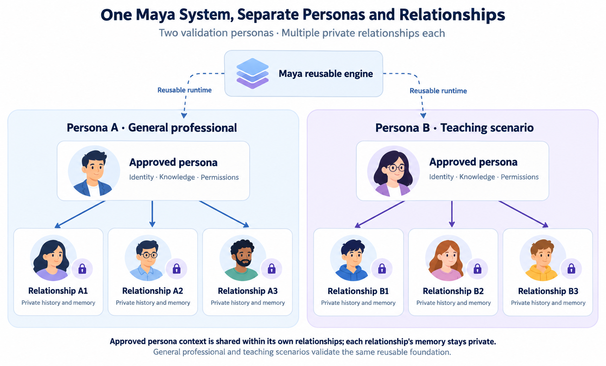
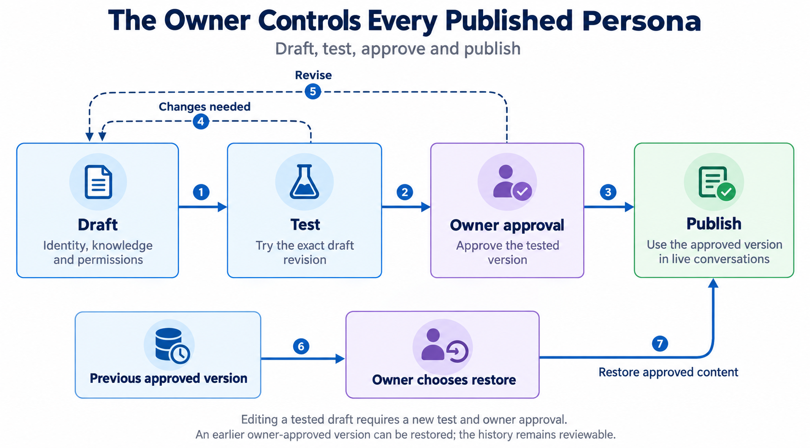
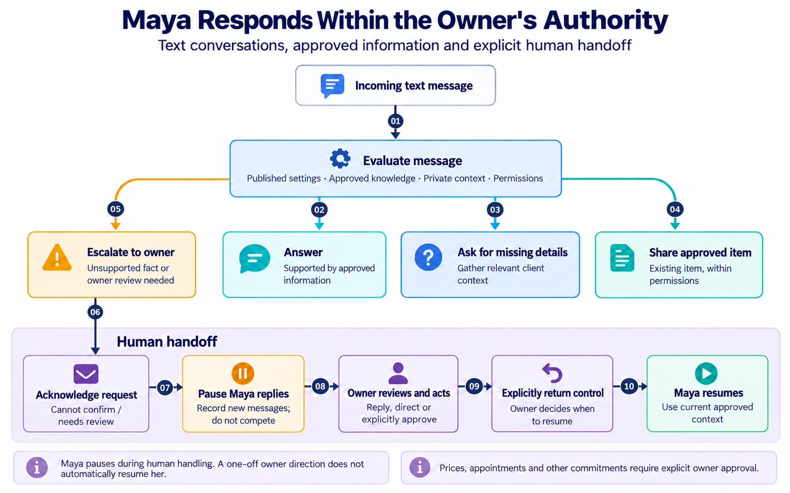

# Maya MVP Scope

Status: Confirmed MVP scope, including the bounded self-improving loop. Detailed loop design and operating parameters remain proposals; measured performance and pilot results require implementation evidence.

## Purpose and sequence

This scope defines Maya’s reusable persona foundation and the behavior it must prove before Petal implementation. The [Petal scope](/petal-mvp-scope) defines the application that uses it; the [roadmap](/implementation-roadmap#proposed-milestone-sequence) sets the build sequence and release gates.

Maya starts as a reusable system with a small interface for configuring and testing personas, without a separate public launch. It should not depend on Petal's profiles, marketplace, or WhatsApp experience. The care, IELTS, and teaching examples in *The Story* show Maya's wider potential; they do not make specialized health or education workflows part of this MVP.

## MVP users and validation approach

- Use text conversations for the validation scenarios below. Deferred capabilities are listed under “Outside this MVP.”
- Validate Maya with two distinct personas and multiple private relationships for each, using a general professional scenario and a teaching scenario. These are validation cases, not separate products to launch.
- Let the represented person configure, test, and approve their persona through the small interface; the project team may assist during the pilot.
- Demonstrate correct use of approved knowledge, separation of relationship histories, enforcement of delegated permissions, human takeover, and a reviewable record of actions before Petal implementation.

*Figure 1. Two validation personas use the same Maya foundation. Each relationship keeps its own private history and memory; approved persona context applies only within that owner's relationships. Three relationships per persona are illustrative, not an MVP limit.*

## Maya MVP: owner control and conversation behavior

*Figure 2. The owner approves the tested version before publication. Draft changes return through testing and approval, and restoring the previous approved version requires the owner's choice.*

The first Maya implementation must support:

- A distinct persona configuration for each person represented, including identity, style, instructions, approved knowledge, and delegated permissions. The project team can assist during the pilot. Changes follow a draft, test, owner approval, and publish flow; the owner can restore the previous published version.
- Separate conversation histories for each relationship and each persona owner. Maya may save source-linked, client-specific facts as private relationship memory. The owner can inspect and correct those facts. Only owner-approved changes can enter knowledge shared across that owner's relationships; a client's statement must not silently become general approved information.
- Immediate evaluation of each incoming text message. Depending on its content and persona settings, Maya can answer from approved information, ask for missing details, propose or share an approved item, or escalate to the owner. An absence switch is not required.
- Explicit permission checks for actions. Custom document generation is a later capability. Personalized documents and commitments require human review before they are sent or made.
- Unknown answers: when approved information does not support a service fact, Maya says she cannot confirm it and hands the question to the owner rather than guessing.
- Human handoff: when Maya needs review, she acknowledges the request promptly and pauses replies in that conversation. The owner can inspect the context, act, and explicitly return control to Maya. Maya must not send a competing reply while the owner has control.
- A reviewable record of what Maya answered, proposed, shared, or escalated, and which persona configuration and authority applied.
- A [bounded self-improving loop](/self-improving-loop): automatically propose and test an allowed change, then require the represented person to approve and explicitly publish its exact tested revision. Retrieval tuning also needs engineering review. Private client facts remain private; later outcomes inform retention or owner-controlled restore.

The first validation can use the text-based testing interface without WhatsApp.

*Figure 3. Message evaluation selects a permitted response or owner escalation. Escalation leads to acknowledgement and paused Maya replies, followed by owner handling and an explicit return of control before Maya resumes. The response branches are alternatives, not sequential steps.*

## Maya validation gates

Test two distinct personas in general professional and teaching scenarios, with multiple private relationships under each. Before Petal implementation, the test evidence should show that Maya:

- Answers supported questions using approved knowledge.
- States that an unsupported service answer cannot be confirmed and escalates it rather than inventing a fact.
- Keeps one relationship's history and one owner's information out of other conversations.
- Saves private relationship facts with traceable sources; corrections affect future responses without changing general approved knowledge.
- Blocks an unapproved action or commitment even if a message asks Maya to perform it.
- Acknowledges and hands off a request that needs the owner, then stops replying until control is returned.
- Leaves an inspectable record of the response or action and the configuration that governed it.
- Applies only a published, owner-approved persona version in live conversations and can restore the previous version.
- Completes a synthetic feedback-to-improvement cycle for both validation personas: a supported gap, bounded candidate, paired tests, explicit owner approval/publication, later use, observation decision, and restore exercise. Failed gates or stale evidence must block adoption; the test interface can prove the loop before Petal exists.

Functional validation is distinct from the pre-pilot capacity gate. The [roadmap](/implementation-roadmap#proposed-milestone-sequence) defines their sequencing; [System Design](/system-design#10-verification-and-release-evidence) specifies the required evidence.

## Outside this MVP

- Voice messages, live calls, and voice cloning.
- Custom document generation and unreviewed personalized commitments.
- Specialized care, IELTS, or classroom workflows beyond the two text-based validation scenarios.
- A standalone public Maya product, professional discovery, and the WhatsApp channel experience.
- Autonomous changes to Maya's core beliefs or cross-persona learning from private conversations. Belief evolution remains an open topic for later discussion.

## Relationship to Petal

Petal adds the public profile, professional workspace, WhatsApp channels, and case inbox described in its [product scope](/petal-mvp-scope). Maya’s test interface must prove the behavior above without depending on those application features.
