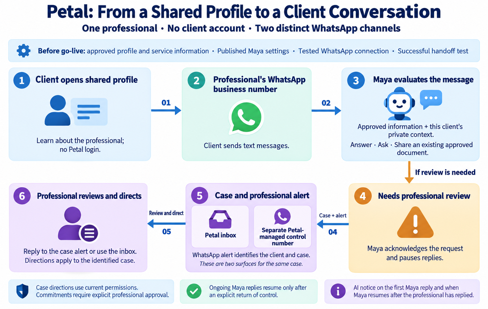
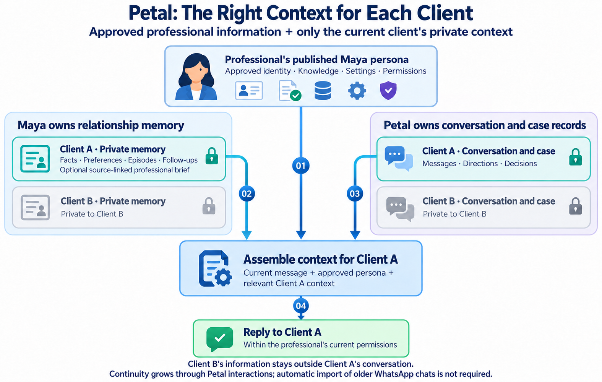
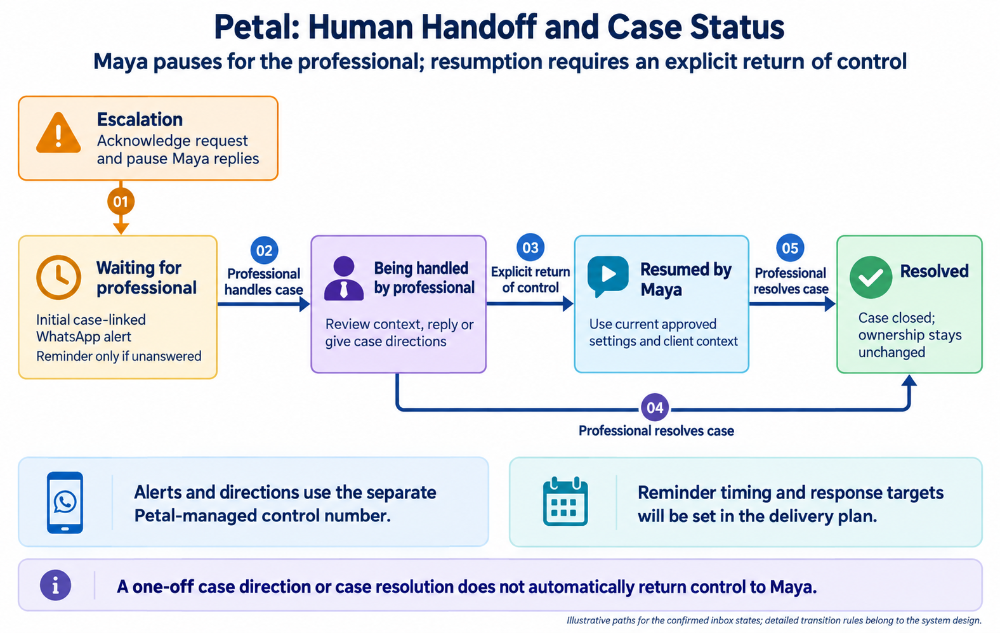

# Petal Product Requirements and MVP Scope

Status: Confirmed Session 3 product scope, extended on 1 October 2026 to include feedback and professional review for the bounded MVP improvement loop. Its detailed design remains proposed. WhatsApp account setup, routing mechanics, notification timing, and measured service targets remain for the technical and delivery documents.

## Product boundary

Petal is the first planned application of Maya. It gives an individual professional a public profile, a private workspace for their professional information and Maya Persona, and a way to continue client relationships through WhatsApp. Maya's reusable MVP is specified separately in [Maya MVP Scope](02-product-requirements-and-mvp-scope.md). Maya must pass its functional validation before Petal is implemented, and the roughly 100-conversation capacity ambition must be tested before a Petal pilot.

The first Petal release supports one professional per workspace across varied professions. Team accounts, specialized profession workflows, and a searchable professional directory are later possibilities.

## Confirmed first-release journey

1. A professional completes guided setup. With assistance from the project team, they prepare a public profile, approved service information and documents, and Maya's persona settings. Before Maya serves real clients, the professional approves them, the WhatsApp connection is tested, and a handoff test succeeds.
2. The professional shares a link to their public Petal profile. A client can learn about the professional there and contact them through the professional's own WhatsApp business number without creating a Petal account. The exact number-connection process remains for technical validation.
3. When a client sends a message, Maya evaluates it immediately under the professional's published settings. She brings in that client's private relationship context and relevant past episodes, alongside the professional's approved information. She can answer, ask for missing details, or share an existing approved document. A brief AI notice appears on Maya's first reply in the conversation and when she resumes after the professional has replied; the professional's identity remains central to the relationship.
4. If a request needs the professional, Maya acknowledges it and pauses her replies in that client conversation. The professional receives a WhatsApp notification from a separate Petal-managed control number. The alert identifies the client and case. The professional can review the case in the Petal inbox and give Maya directions in natural language by replying to the alert; that reply applies to the identified case. If a new instruction could refer to more than one case, Maya asks which client is meant. The professional may also respond through the inbox. Directions, decisions, and any return of control are recorded with the client case.

*Figure 1. A client reaches the professional through the shared profile and business number. Requests needing review become cases in the Petal inbox and generate alerts through the separate Petal-managed control number. Replies to alerts provide directions for the identified case.*

The professional controls their profile, approved knowledge, documents, and Maya settings in the private workspace. Maya owns private client relationship memory, scoped to each professional and client; Petal owns the WhatsApp conversation and case records. The two kinds of context remain distinct from the professional's general approved information.

A clear instruction from the professional can authorize Maya to send a routine reply or an existing approved item for the identified client case, within the persona's current permissions. Prices, appointments, and other commitments require explicit approval. A case instruction does not silently change the professional's published knowledge or persona settings.

The professional-facing WhatsApp chat initially supports case directions and status questions. A professional may also describe a desired change to their profile, approved knowledge, or Maya settings there; Maya can prepare it as a draft. The professional tests and publishes any standing change in the Petal workspace before it affects client conversations.

The private workspace also supports the [bounded improvement loop](07-self-improving-loop-design-and-mvp-scope.md). The professional can classify feedback as a case correction, private relationship correction, or standing-information change, and review Maya's suggested improvements with their exact diff, sources and test results. Approval and publication happen in the workspace; a case-linked WhatsApp direction does not publish a general change. Later outcomes inform retention or an owner-controlled restore. Allowlisted retrieval tuning also requires engineering review.

## First-release boundaries already decided

| Included | Later or requiring professional review |
|---|---|
| Shareable professional profile; guided professional setup; one professional per workspace; no client account. | Searchable directory and self-service onboarding. |
| Client text conversations through the professional's own WhatsApp business number. | Voice messages and live calls. |
| Maya's authorized text replies, intake questions, and sharing of existing approved documents. | Custom document generation; personalized documents and commitments require professional review. |
| Petal inbox plus case-linked WhatsApp escalation alerts from one Petal-managed control number; natural-language directions to Maya and return of control. | Team and organization workflows; exact account setup and routing mechanism remain open. |
| Private, continuing relationship context for each client, including relevant facts, episodes, follow-ups, and an optional professional-supplied brief for an existing client. | Automatic import of earlier chats is not required for the MVP. |
| Verified feedback and workspace review of automatically drafted/tested persona improvements, with explicit owner publication and observation. | Automatic publication, model fine-tuning, production-code rewriting, and shared learning from private client content. |

## Relationship continuity

The [One Self, Many Faces](https://claude.ai/artifact/3kvkcjiCU6W2ubLdKMqj5L) artifact proposes one stable identity with a private history and a different relational "face" for each person. Applied to Petal, the professional's Maya Persona keeps a separate relationship state for each client: relevant facts and preferences, prior episodes, and pending follow-ups. For each message, Maya assembles the professional's approved identity and knowledge with only that client's relevant relationship context. One client's information must not appear in another client's conversation.

This continuity grows through ongoing Petal interactions. For an existing client, the professional can add a private, source-linked relationship brief before the first Petal-connected message. Maya can clarify uncertain details with the client and update that client's private memory. Automatic import of older WhatsApp chats is not required for the MVP; it could be examined later as one possible source of earlier context.

*Figure 2. For an illustrative Client A message, Maya combines the approved professional persona with relevant Client A context. Maya's private relationship memory and Petal's conversation and case records remain distinct, and Client B's information stays outside this conversation.*

## Profile and go-live minimum

The public profile includes the professional's name, a short service description, whether they work locally or remotely, and an action to contact them on WhatsApp. A photo, credentials, and more detailed offerings are optional in the first release. The professional's private workspace holds information that is not approved for public display.

Guided setup must leave an approved profile, approved service information, published Maya settings, a tested client-facing WhatsApp connection, and a successful handoff test. The professional's own business number serves clients. One separate Petal-managed WhatsApp number serves professional alerts and directions; its registration, routing, and presentation will be designed later.

## Handoff states and alerts

The Petal inbox shows whether a case is waiting for the professional, being handled by the professional, resumed by Maya, or resolved. Maya sends an initial WhatsApp alert on escalation and a reminder if the case remains unanswered. The delivery-plan work will set the reminder interval and measured response targets. A professional can ask Maya about pending cases through the professional-facing WhatsApp chat.

*Figure 3. Common paths through the confirmed inbox states. The professional can resolve a case without first resuming Maya; a case resolution or one-off direction does not itself return control. Reminders apply to unanswered cases, with timing defined in the delivery plan.*

## Product acceptance checks

- A client can open a shared profile and reach the professional on WhatsApp without a Petal login.
- A professional cannot go live until their profile, service information, and Maya settings are approved and the client connection and handoff have been tested.
- Maya uses only the relevant client's private relationship context, including any professional-supplied brief, and keeps other clients' context separate.
- An escalation pauses Maya on that case, alerts the professional on WhatsApp with an identifiable case, and appears in the Petal inbox.
- A reply to an alert is applied to that case; Maya asks for clarification if an independent instruction is ambiguous.
- Routine, permitted directions can result in a reply or an approved-item send. Commitments still require explicit approval, and standing changes still require testing and publication in the workspace.
- The professional can inspect and reject a suggested improvement, or approve and publish its exact tested revision. Stale evidence, failed gates, missing source authority, or missing retrieval engineering review blocks adoption; publishing or restoring cannot resume a paused client conversation.
- Each pilot persona closes at least one real feedback-to-publication-to-observation cycle with later runtime-use evidence, distinguished from synthetic demonstrations and insufficient samples.
