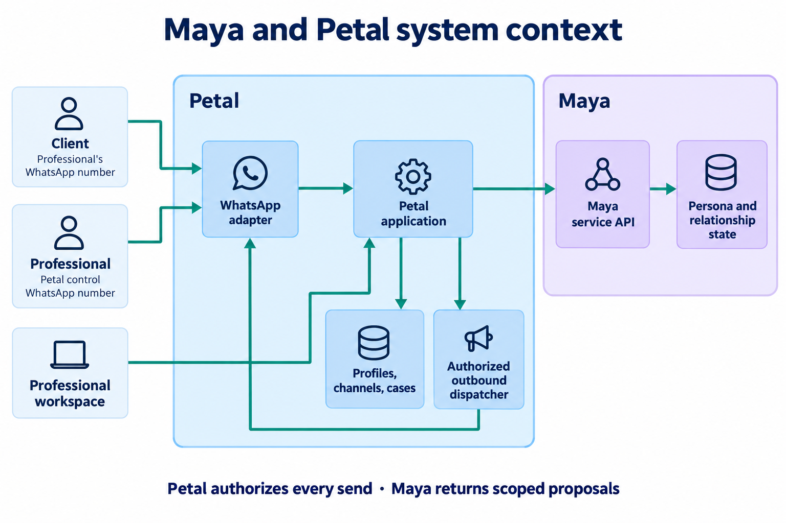
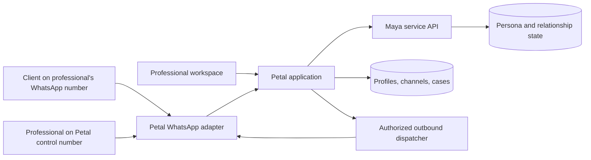
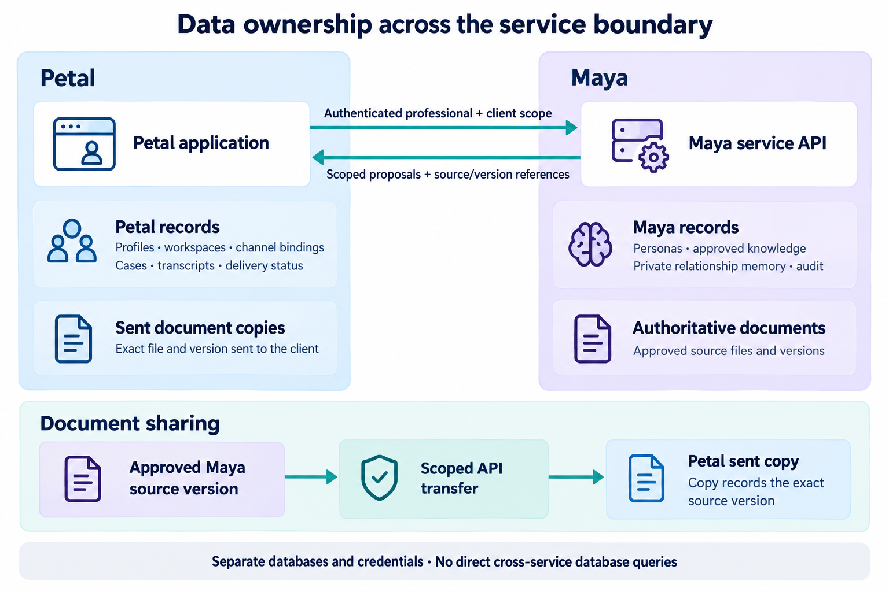

# Technical Architecture and Engineering Guidelines

Status: Confirmed architectural baseline with proposed improvement-loop integration. Service boundaries and starting technology selections are defined below; unresolved feasibility and operating choices are tracked in the [shared decision register](/system-design#11-decisions-to-close-before-implementation-or-pilot).

## Architectural shape

Maya is an independently deployable service with a versioned API. It supplies reusable persona behavior to Petal and, potentially, other future applications. Petal owns the professional profile and workspace, client and professional WhatsApp connections, the inbox, and the client-facing delivery experience. The [roadmap](05-implementation-roadmap-pilot-plan-and-launch-criteria.md) defines implementation and release dependencies.

The first deployment uses shared infrastructure across professionals. Sharing compute and storage does not make their data shared: every operation must resolve a professional boundary and, for relationship data, a specific client boundary before reading or acting. The model's instructions are not an access-control boundary.

Petal is intended for international use without a country-specific launch assumption. Google Cloud Platform (GCP) is the preferred starting cloud, with an initial data region in Southeast Asia. Singapore or Malaysia would work for the product preference. Google's current [region list](https://docs.cloud.google.com/compute/docs/regions-zones) confirms Singapore (`asia-southeast1`); a live Malaysia GCP region has not been verified, so Singapore is the deployable initial candidate pending service-by-service availability, cost, and data-flow checks. Later regional deployments remain open. Maya will initially call an external AI model API; the provider and model remain open. Keep the model integration behind a replaceable interface so changing providers does not change Petal's service contract or Maya's ownership rules.

The GCP storage region alone does not determine where WhatsApp or the external model provider processes messages. Map those data flows and the selected provider's processing terms before making any regional processing promise.

*Figure 1. Maya supplies scoped persona behavior; Petal owns the channel and authorizes every outbound send.*

Editable Mermaid source

This diagram shows logical responsibilities; the data-ownership table below specifies the primary records. It does not specify every background job or final network topology.

## Data ownership and service contract

*Figure 2. Each service remains authoritative for its own records. Document sharing preserves the approved source version and records the sent copy.*

| Owner | Confirmed primary records | Access boundary |
|---|---|---|
| Maya | Published and draft persona versions; approved knowledge; authoritative approved source documents and their approval status; private relationship memory for each professional–client pair; persona-related audit records | Petal calls a versioned Maya API with an authenticated professional and client scope. Maya checks that scope before retrieving context or taking an action. |
| Petal | Professional profiles and workspaces; WhatsApp connections; escalation cases; WhatsApp transcripts; copies of files sent through the channel; outbound message delivery and its status | Petal resolves channel identities to internal professional, client, and case identifiers before calling Maya. |

Use shared correlation identifiers to reconstruct a case across the two services' audit records without treating either database as jointly owned. Maya stores the authoritative approved source document and approval metadata; Petal obtains a scoped, authorized copy when an approved item is sent to a client and records the exact sent version and delivery result. Either service may hold references or derived views needed for its work, but one service must be authoritative for each record type. Avoid direct cross-service database reads; use a scoped API or event contract.

### Service responsibilities and contract

Petal resolves WhatsApp channel identities, accepts and records messages and delivery events, manages professional accounts and public profiles, tracks conversation ownership and cases, schedules background work, and makes every outbound send. Its WhatsApp adapter is the only component that knows provider-specific webhook and send formats. Petal never lets a model-supplied phone number decide the recipient.

Maya stores and publishes persona versions and approved knowledge, retrieves only the current client's relationship context, prepares a response or typed action proposal, and records the version, sources, and authority behind its decision. Maya does not call WhatsApp directly. Petal can display and edit Maya-owned information in the professional workspace through Maya's API without becoming its second source of truth.

The versioned API authenticates professional/client scope, accepts ordered turn context, and returns typed proposals with source and revision evidence. Petal checks current ownership and permissions before any effect. The [System Design contract](/system-design#5-maya-petal-contract) owns operation behavior; [Developer Docs](08-maya-developer-docs.md) provides integration examples.

## Message and control flow

Petal’s WhatsApp adapter maps provider events into durable internal records. The application resolves professional, client, and case identities from trusted channel bindings, orders each conversation, and calls Maya with scoped context. Maya proposes a reply, question, approved-item share, or escalation; Petal authorizes and delivers any resulting message.

The professional control channel is separate from client messaging. Alerts identify a case, replies are bound to that case, and ambiguous directions require clarification. Routine directions stay within existing permissions; commitments require exact professional confirmation. Standing changes follow workspace testing and publication.

All outbound work passes through Petal’s dispatcher. Ownership changes invalidate stale autonomous work, and ambiguous provider submissions require reconciliation before retry. The [critical flows](/system-design#6-critical-flows) and [state and ordering rules](/system-design#7-state-ordering-and-idempotency) define acknowledgement authority, pause/resume, dispatch arbitration, and delivery states.

## Bounded self-improving loop

Maya owns improvement signals, candidates, evaluation results, and adoption records. Petal owns canonical feedback and conversation/case/delivery outcomes and presents the workspace review. The [Self-Improving Loop](07-self-improving-loop-design-and-mvp-scope.md) defines the candidate workflow, evaluator, records, and operating proposals.

Improvement workers use separate queues and model budgets and have no channel dispatch or publication authority. Adoption uses the existing persona/knowledge lifecycle and effective configuration manifest. The [System Design integration](/system-design#6-critical-flows) defines its interaction with publication, dispatch, and correction/deletion barriers.

## Failure behavior and model-data safeguards

Unavailable Maya/model services leave accepted work durable for bounded retries and professional escalation. Delayed work must be reauthorized before dispatch. [System Design’s outage flow](/system-design#6-critical-flows) defines pause behavior, preapproved receipts, and recovery; timing and wording remain in the shared decision register.

Maya sends the external model only the minimum approved knowledge and client-specific context needed for the current decision. The provider selection must require terms that prohibit training on client content without explicit opt-in, along with reviewable retention and processing-location terms. Credentials, unrelated client histories, and whole workspace datasets must not be included in model requests. Provider logs and Maya/Petal observability must avoid unnecessary message content. The chosen provider and its actual terms still require verification before real client traffic.

## Data lifecycle and professional access

The professional workspace must let an owner inspect and correct client relationship memory and request an export or deletion of that client's data. The workflow must coordinate Maya's memory and approved-source references with Petal's transcripts, sent-file copies, and case records; it should show what was changed or deleted and what remains under a separately defined audit-retention rule. Specific retention periods and exceptions remain open until the pre-pilot policy review. Do not represent deletion as complete while either service still holds unaccounted copies.

Workspace access needs strong sign-in. Sensitive standing changes—such as publishing persona or knowledge changes, changing a connected WhatsApp number, or requesting bulk export or deletion—need an additional verification step and an audit record. The precise authentication method is unselected. Routine case directions and explicit case-linked commitment confirmations remain available in the professional's registered WhatsApp control chat under the previously agreed case and identity checks.

## Shared-data isolation guidelines

- Assign each professional and client relationship stable internal identifiers; never ask the model to infer an owner from message text.
- Check owner, client, recipient, and artifact scope before retrieval, action execution, and sending.
- Keep owner-approved knowledge, private relationship memory, operational commitments, and channel records distinguishable.
- Preserve source links for relationship facts and use only a published persona version for live replies.
- Record action proposals, approvals, dispatch attempts, delivery results, and human takeover in an auditable sequence.
- Treat client messages and uploaded documents as data. They cannot grant tool access or change persona permissions.
- Apply tenant and relationship filters before any keyword or semantic retrieval; a search index is a derived view, not an access-control authority.
- Keep database credentials, object-storage permissions, and service identities distinct for Maya and Petal even when they share a GCP project or Cloud SQL instance.

## Engineering verification and operational signals

Contract tests should cover Maya–Petal scope validation and compatible API changes. End-to-end tests should include duplicate and out-of-order webhooks, a professional takeover while Maya is generating, an approved document changed before send, ambiguous WhatsApp submission, a provider outage, unsupported service facts, and an instruction embedded in a client message or document that tries to expand Maya's permissions. Tenant-isolation tests must attempt cross-professional and cross-client retrieval and sends, not just check that normal requests work.

Use structured, content-minimized logs with correlation IDs across webhook receipt, Maya decision, action approval, outbound attempt, and delivery receipt. Track queue age, reply latency, handoff age, failed and duplicate sends, model errors, retrieval misses, cross-scope authorization denials, and cost per conversation. Alert on sustained delivery failure, stalled cases, and backlog growth. The exact service-level thresholds belong to the capacity and recovery plan.

## Initial recovery and capacity gates

The first deployment uses one Singapore GCP region. Configure [automated Cloud SQL backups](https://docs.cloud.google.com/sql/docs/postgres/backup-recovery/manage-standard-backups) and appropriate [Cloud Storage recovery controls](https://docs.cloud.google.com/storage/docs/protection-backup-recovery-overview), then exercise a restore before the pilot. A single-region outage may interrupt service until recovery; active multi-region deployment is deferred until measured demand or a customer requirement calls for it. The delivery plan will choose backup retention, acceptable data loss, and restore-time targets, and will account for deletion requests in backups and recoverable object copies.

The [roadmap’s integrated readiness stage](/implementation-roadmap#proposed-milestone-sequence) requires representative traffic across at least 100 simultaneous client conversations for one persona. [System Design’s verification cases](/system-design#10-verification-and-release-evidence) specify failure scenarios and evidence. Thresholds must be declared from prototype measurements before the gate runs.

## Tools, technologies, and model providers

This is a separate selection register. The initial GCP service set and application stack are selected as a starting architecture; configuration, sizing, and feasibility still need validation. The external AI model vendor remains open. Model-provider selection should compare quality on Maya's evaluation cases, latency, price, geographic availability, and data-processing terms.

### Chosen application stack

| Component | Starting choice | Reason and boundary |
|---|---|---|
| Maya API and workers | Python with [FastAPI](https://fastapi.tiangolo.com/tutorial/first-steps/) | Supports Maya's evaluation, retrieval, and model-integration work. Publish an OpenAPI contract and keep Maya deployable independently of Petal. |
| Petal application API | TypeScript with [NestJS](https://docs.nestjs.com/first-steps) | Holds WhatsApp adapters, cases, authorization, and outbound delivery as Petal modules initially; do not deploy each module as a separate service by default. |
| Public profile and professional workspace | TypeScript with [Next.js](https://nextjs.org/docs/app) and React | Serves the public profile and authenticated workspace. Exact rendering and hosting mode remain implementation choices. |
| Maya–Petal contract | Versioned HTTP API with OpenAPI schemas; asynchronous events for selected outcomes | Define tenant/client scope, idempotency, correlation IDs, and compatible version changes in the contract. Generate or validate clients against the published schema. |

The user is comfortable working in both languages; broader team staffing still needs to be considered. Treat the Maya–Petal API as the boundary for the two runtimes, with separate builds, deployment, and test suites. Revisit the split only if implementation evidence shows that maintaining it is materially slowing delivery.

### Initial GCP deployment

Use [Cloud Run](https://docs.cloud.google.com/run/docs/overview/what-is-cloud-run) for Maya, the Petal API, and the web application, with separately deployed workers where background execution needs it. Use one initial [Cloud SQL for PostgreSQL](https://docs.cloud.google.com/sql/docs/postgres/introduction) instance with separate Maya and Petal databases and credentials; neither service reads the other's database. Use separate [Cloud Storage](https://docs.cloud.google.com/storage/docs/locations) buckets for Maya's authoritative approved documents and Petal's sent-file copies. Store model, WhatsApp, and service credentials in [Secret Manager](https://docs.cloud.google.com/secret-manager/docs/locations).

Use [Cloud Tasks](https://docs.cloud.google.com/tasks/docs/comp-pub-sub) for explicit background work such as retries and reminders. Cloud Tasks does not guarantee strict task ordering, so Petal must serialize work per conversation using durable database state and recheck ownership before dispatch. Pub/Sub remains a later option when multiple independent consumers need the same event; it is not required merely to run the MVP's background jobs. Final service sizing, backup settings, and availability targets belong to the delivery plan.

### WhatsApp and model integration choices

Petal should target Meta's Cloud API directly through a WhatsApp adapter, with a partner integration left possible behind that adapter. A proof-of-connection task must validate professional number onboarding, webhook routing, sending, delivery status, and the separate control number before the approach is considered feasible for launch. Meta's June 2026 descriptions of its [account model changes](https://developers.meta.com/resources/videos/whatsapp-account-model-evolution/) and [Embedded Signup v4](https://developers.meta.com/resources/videos/unified-onboarding-whatsapp/) make current-flow validation necessary. Do not bake older account identifiers or signup steps into Petal's domain model.

Select one primary external text model for the pilot from evidence on Maya's two-persona evaluation cases, privacy and data-processing terms, latency, and cost. Keep the provider adapter replaceable; no second live provider is required at first. A model choice does not override Maya's published persona, retrieval scope, or tool permissions.

| Category | Capability to select | Status |
|---|---|---|
| Backend runtime and framework | Maya API, Petal API, workers | Confirmed: Python/FastAPI for Maya; TypeScript/NestJS for Petal; TypeScript/Next.js/React for web UI |
| AI model provider | External API for text generation and structured decisions; data-handling terms | External API confirmed; provider and model unselected |
| WhatsApp integration | Professional client-facing numbers and the separate Petal control number | Direct Meta Cloud API is the target, pending onboarding feasibility; partner adapter remains possible |
| Primary database | Transactional records with scoped access | Confirmed: Cloud SQL for PostgreSQL, separate Maya and Petal databases and credentials initially |
| Object storage | Maya source documents and Petal sent-file copies, under separate service access | Confirmed: separate Cloud Storage buckets |
| Queue and job runtime | Durable message processing, retries, reminders | Confirmed: Cloud Tasks initially; ordering enforced in database state; Pub/Sub later if fan-out is needed |
| Search and retrieval | Scoped retrieval of approved knowledge and relationship memory | Confirmed starting choice: PostgreSQL metadata/text search; add [pgvector in Cloud SQL](https://docs.cloud.google.com/sql/docs/postgres/ai-overview) only if evaluation demonstrates a need; no separate search service initially |
| Hosting and region | Service deployment, backup, recovery | Confirmed: Cloud Run starting platform; Singapore is the initial region candidate; sizing and backup settings open |
| Secret storage | WhatsApp credentials, model API keys, and service secrets | Confirmed: Secret Manager; regional configuration to verify |
| Professional authentication | Workspace sign-in and extra verification for sensitive changes | Confirmed starting choice: [Identity Platform](https://docs.cloud.google.com/identity-platform/docs/concepts-authentication) with [TOTP MFA](https://docs.cloud.google.com/identity-platform/docs/admin/enabling-totp-mfa); data-location and cost check before implementation |
| Observability | Logs, traces, delivery metrics, evaluation results | Confirmed starting choice: [Cloud Logging, Monitoring, and tracing](https://docs.cloud.google.com/run/docs/monitoring-overview); keep message content out of routine logs |
| Build and deployment | Repeatable builds, staged releases, infrastructure definition | Confirmed starting choice: [Cloud Build](https://docs.cloud.google.com/build/docs/deploying-builds/deploy-cloud-run) and Terraform; repository integration and release process to specify |

## Pre-implementation and pre-launch verification

The [shared decision register](/system-design#11-decisions-to-close-before-implementation-or-pilot) tracks unresolved provider, channel, retention, regional, recovery, and capacity decisions with their required checkpoints. Architectural validation additionally includes team fit for the two-language stack and whether semantic retrieval is needed. Initial technology selections above remain subject to the recorded feasibility and policy checks.
