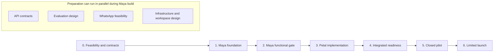
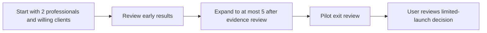

# Implementation Roadmap, Pilot Plan, and Launch Criteria

Status: Working delivery draft. The Maya-first build sequence, four parallel agentic workstreams, release-owner review, and initial pilot size and duration are confirmed. Open effort, pilot, and operating choices are tracked in the [shared decision register](/system-design#11-decisions-to-close-before-implementation-or-pilot).

## Purpose and planning basis

This plan turns the confirmed [Maya scope](02-product-requirements-and-mvp-scope.md), [Petal scope](03-petal-product-requirements-and-mvp-scope.md), and [technical architecture](04-technical-architecture-and-engineering-guidelines.md) into build and release gates. Maya must pass her functional validation before Petal implementation. The roughly 100-conversation capacity ambition is a separate gate before a Petal pilot. Parallel work must respect those dependencies.

Use agentic development in parallel, with each workstream managing a bounded responsibility and recording its decisions, tests, interfaces, and handoff material. These records should describe ongoing duties and needed skills so a future recruited person can assume the role. The user reviews all workstream outputs and resolves cross-workstream decisions as the initial integration and release owner. Do not turn an agent count directly into a calendar estimate; track integration and user review work as part of the schedule.

## Planning and release gates

The [bounded self-improving loop](07-self-improving-loop-design-and-mvp-scope.md) is MVP work. Estimate its dependencies, implementation and review capacity alongside the baseline milestones. Pilot readiness requires Maya's expanded functional gate, the integrated 100-conversation capacity test, a restore exercise, and the professional's go-live check. Limited launch follows reviewed pilot evidence.

The critical path is external WhatsApp feasibility, model-provider terms, the Maya gate, Petal integration, and the integrated capacity/recovery gate. Agentic parallelism helps with separate workstreams but cannot make a failed gate pass. A direct Meta integration that is not feasible by the early checkpoint triggers the previously accepted partner option rather than an unbounded wait; any route still needs tested number ownership, webhooks, sends, and delivery receipts. Meta's June 2026 [account-model](https://developers.meta.com/resources/videos/whatsapp-account-model-evolution/) and [Embedded Signup](https://developers.meta.com/resources/videos/unified-onboarding-whatsapp/) changes make the first-week connection spike important.

Keep the agreed [Maya](02-product-requirements-and-mvp-scope.md) and [Petal](03-petal-product-requirements-and-mvp-scope.md) release boundaries fixed; deferred capabilities do not enter the critical path. If a mandatory gate slips, move the pilot start rather than dropping the gate or relabeling an internal test as a real-user pilot.

## Proposed milestone sequence

*Figure 1. Maya validation precedes Petal implementation. Integrated readiness and pilot evidence control progression to release; the diagram sets no calendar dates.*

Editable Mermaid source

| Stage | Work and evidence | Exit condition |
|---|---|---|
| 0. Feasibility and contracts | Validate current Meta number onboarding and control-channel path; check model-provider terms and evaluation candidates; confirm Identity Platform data-location/cost fit; specify the versioned Maya–Petal API and evaluation cases. | No untested external dependency is treated as launch-ready; Maya's first slice has a stable contract and test cases. |
| 1. Maya foundation | Build persona draft/test/approve/publish, approved knowledge and documents, private relationship memory, text runtime, typed action proposals, human takeover, and audit. | Two distinct personas can be configured and exercised in the channel-independent test interface. |
| 2. Maya functional gate | Evaluate supported and unsupported answers, owner/client isolation, permissions, source-linked memory correction, approved-item sharing, takeover races, and rollback. | The agreed Maya functional checks pass with reviewable evidence; only then begin Petal implementation. |
| 3. Petal implementation | Build public profiles, guided workspace setup, WhatsApp adapter, message ingress, cases and inbox, professional control chat, authorized dispatcher, and the Maya API integration. | End-to-end journeys work with test numbers and professional-approved content. |
| 4. Integrated readiness | Test direct Meta connection and delivery states, privacy and authorization, model outage behavior, backup restore, observability, and representative simultaneous load across 100 client conversations for one persona. Set numerical thresholds from the Maya prototype before this gate runs. | Launch and capacity checks are evidenced; critical failures are fixed or block the pilot. |
| 5. Closed pilot | Invite a small group of real professionals and their willing clients. Guide setup, introduce professionals in stages, review cases and feedback, and measure experience, safety, reliability, and cost. | Pilot exit criteria and unresolved issues are reviewed before widening access. |
| 6. Limited launch | Expand availability only after pilot findings are resolved and support, monitoring, data lifecycle, and recovery procedures are ready. | A launch decision is recorded against the criteria below. |

This order does not prevent early parallel work on API contracts, evaluation design, Meta feasibility, infrastructure setup, and workspace design while Maya is built. It does prevent the Petal implementation from assuming Maya's behavior is already validated.

## Self-improving loop work and gates

The [improvement-loop specification](07-self-improving-loop-design-and-mvp-scope.md) owns its workflow and proposed observation policy. This section assigns its work and evidence to the delivery milestones.

Add the following work to the baseline milestones without reversing the Maya-first dependency:

- During Maya foundation, specify feedback/candidate manifests, source invalidation, the allowlisted patch categories and independent synthetic evaluation suites. Build bounded mining, drafting and evaluation with existing persona/knowledge lifecycle controls.
- At the Maya functional gate, complete a synthetic loop for each validation persona, including verified signal, paired tests, exact owner publication, later use, observation decision and restore. Include retrieval dual review, stale/failed-gate rejection and private-context isolation.
- During Petal implementation, connect canonical feedback/outcomes and the Learning workspace. Case directions remain case-specific; general improvement approval happens in the verified workspace.
- At integrated readiness, prove correction/deletion, publication/dispatch races, budget/recovery behavior and the 100-conversation gate while loop work is active under its declared quotas. Set actual budgets, provider/purpose/retention controls and numerical thresholds before enabling real-data model work.
- During the closed pilot, close at least one complete cycle for every pilot persona using real feedback and later live-turn evidence. Apply the [declared observation policy](/self-improving-loop#11-measurement-after-publication-and-restore); insufficient evidence remains visible and can extend the exit review.

Maya/evaluation owns the loop, Petal/WhatsApp owns feedback and outcome delivery, profile/workspace owns review usability, and platform quality/operations owns independent suites, quota isolation and recovery. Retrieval tuning needs both engineering and professional review. The user reviews platform release evidence; each professional controls publication of their own persona. [Document 07](07-self-improving-loop-design-and-mvp-scope.md) contains the proposed acceptance cases and source-review reconciliation.

## Agentic delivery model

Use four agentic workstreams with explicit responsibilities and documentation suitable for later human recruitment. The assignment of individual agents and detailed task backlogs can change without changing these ownership boundaries:

| Workstream | Scope | Required handoff material |
|---|---|---|
| Maya and evaluation | Persona lifecycle, runtime, knowledge/memory, model adapter, action proposals, functional and capacity evaluation. | API/schema, evaluation set and results, failure taxonomy, operational guide, future role description. |
| Petal and WhatsApp | Channel bindings, webhook ingress, case state, professional control chat, dispatcher, delivery reconciliation. | Integration contract, test fixtures, Meta onboarding notes, incident runbook, future role description. |
| Profile and workspace | Public profile, guided onboarding, owner controls, case inbox, data inspection and export/deletion requests. | User journeys, UI acceptance criteria, accessibility checks, support guide, future role description. |
| Platform quality and operations | GCP infrastructure, authentication, isolation checks, CI/CD, observability, backup/restore, security and load tests. | Infrastructure definitions, release checklist, dashboards, restore record, future role description. |

The user is the initial human integration and release owner and will review every workstream's outputs. Each workstream should present a concise change summary, evidence from tests or evaluations, open risks, and any decision needed from the user. Cross-workstream interface changes need coordinated review before dependent work uses them. Workstreams can support their own areas during the pilot, but pilot participants are real professionals and clients.

## Pilot design to decide

*Figure 2. Pilot expansion and limited launch require reviewed evidence. Duration is a planning range; this rollout establishes no start or launch date.*

Editable Mermaid source

The pilot uses invited real professionals and their willing clients, with guided setup and the same AI notice and human handoff rules as the intended first release. Start with two professionals and expand to no more than five after reviewing early results. Each professional works with a small group of willing clients; exact client counts remain open. Plan for roughly four to six weeks, with the clock and exit review defined in the pilot runbook. Do not assume a launch country. Select participants whose routine service interactions fit the MVP's text and approved-document scope. Specialized health workflows and voice calls are outside this first pilot. The service mix and volume of real conversations remain to be decided before invitations.

Bring professionals live in stages so the team can inspect early failures before adding more. Review whether clients understand Maya's role, whether the professional trusts the handoff, whether approved knowledge supports answers, and whether private relationship memory stays accurate and separated. Track conversation outcomes, escalations, reply and delivery latency, failed sends, professional correction effort, and cost. The 100-conversation load gate is a pre-pilot test, not a requirement for pilot traffic.

## Launch criteria and remaining decisions

A limited launch requires documented evidence that Maya's functional gate and the integrated capacity gate passed; cross-professional and cross-client isolation holds; permissions and commitment approvals work; Meta onboarding and channel rules are validated; the chosen model provider meets the agreed data-handling requirements; backup restore has been exercised; and professionals can inspect, correct, export, and request deletion of relationship data under a defined retention policy. The team must have case handling, outage notices, monitoring, and an incident response owner in place.

Set measurable thresholds for latency, failures, handoff age, and recovery from prototype and pilot evidence before making a launch decision. Do not treat a successful demo as evidence for these gates. The user reviews the gate evidence and makes the initial pilot and limited-launch release decisions. The [shared decision register](/system-design#11-decisions-to-close-before-implementation-or-pilot) tracks pilot service mix, client counts, effort forecasts, and operational thresholds. Progression follows reviewed gate and pilot evidence.
