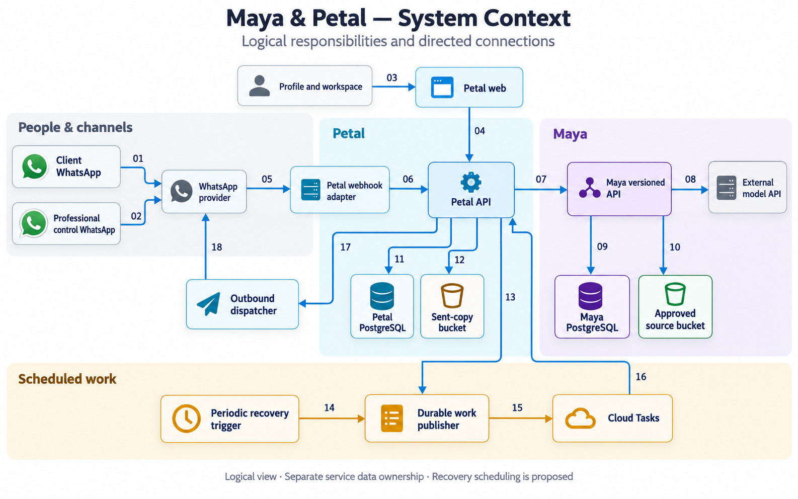
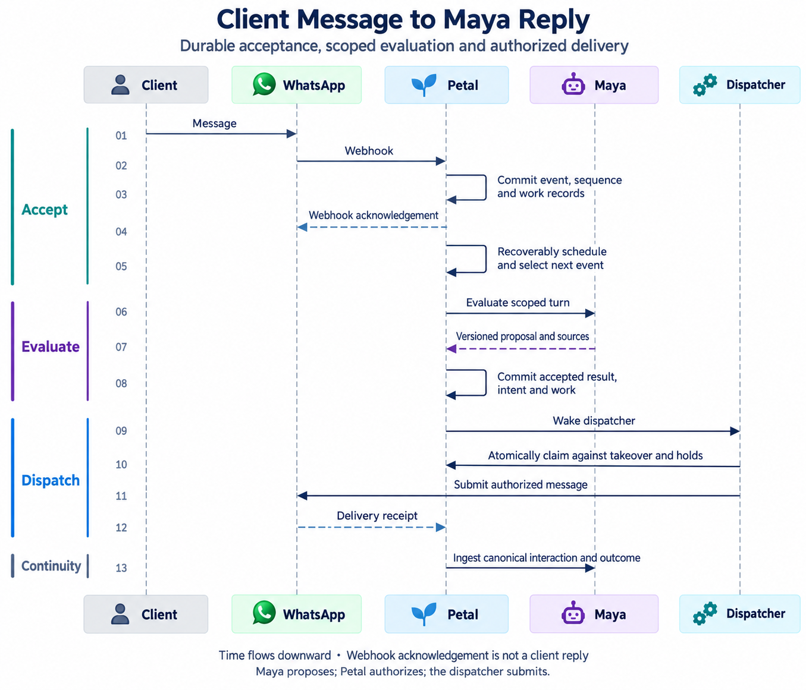
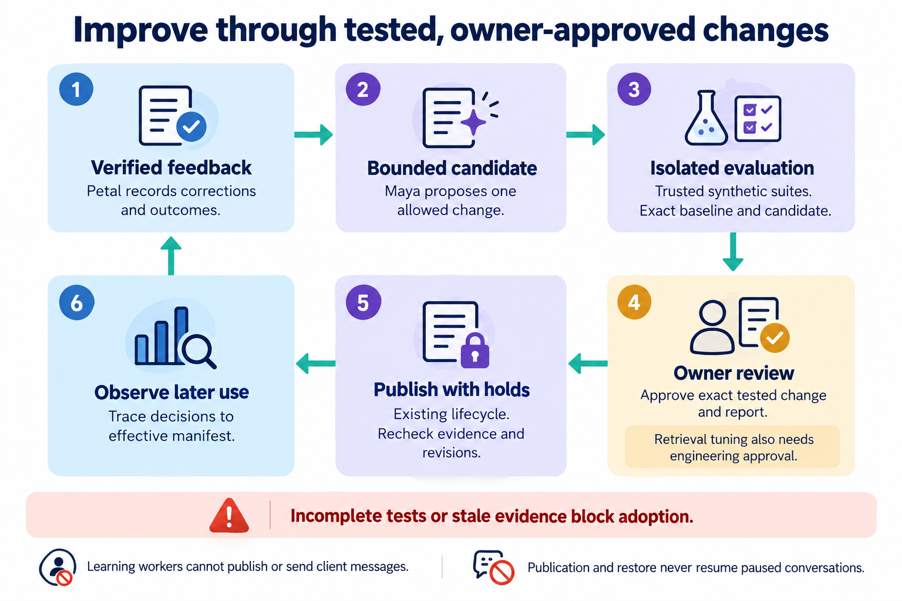
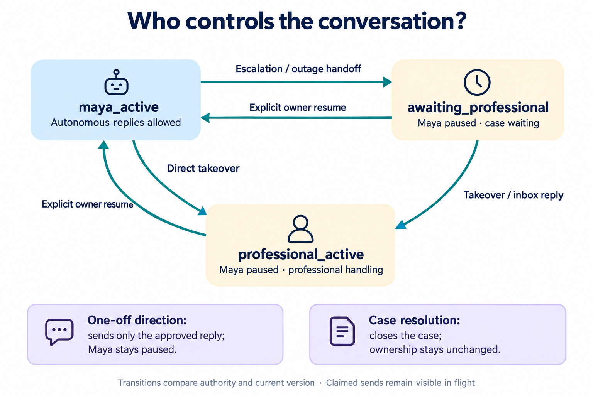
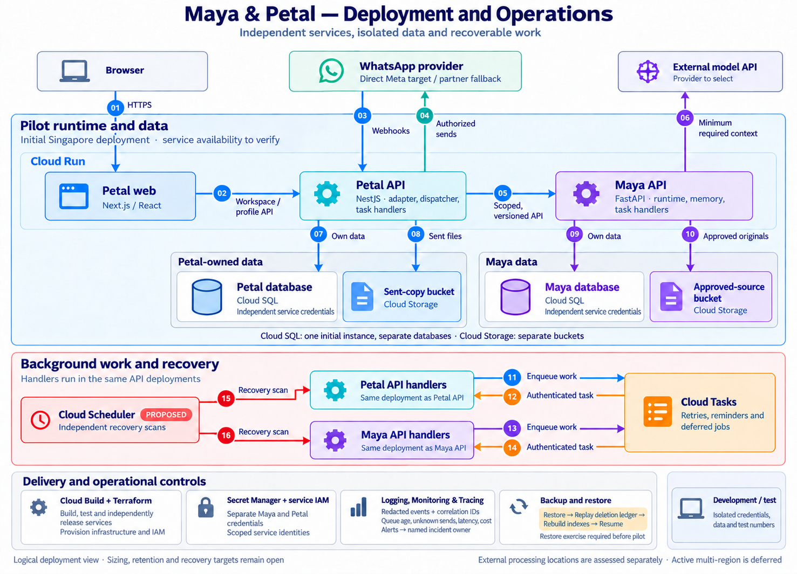

# System Design Document: Maya and Petal MVP

Status: **Revised technical review draft, 1 October 2026.** This document translates the confirmed [Maya MVP scope](02-product-requirements-and-mvp-scope.md), [Petal MVP scope](03-petal-product-requirements-and-mvp-scope.md), and [Session 4 architecture baseline](04-technical-architecture-and-engineering-guidelines.md) into an implementable design. This revision addresses the nine findings and additional coverage gaps in the [SDD review](reviews/2026-10-01-system-design-review.md). The mechanisms below are proposed engineering design; they do not record additional confirmed product decisions. Exact schemas, provider capabilities, and numerical operating targets still require the [delivery gates](05-implementation-roadmap-pilot-plan-and-launch-criteria.md).

## 1. Purpose and design rules

The [bounded self-improving loop](07-self-improving-loop-design-and-mvp-scope.md) is part of the MVP. That document owns its detailed proposal; this SDD integrates it into the service, publication, dispatch, and data-lifecycle contracts. Loop parameters remain proposed and require measured gate evidence.

This design implements the [Maya](02-product-requirements-and-mvp-scope.md) and [Petal](03-petal-product-requirements-and-mvp-scope.md) scope boundaries. [Technical Architecture](04-technical-architecture-and-engineering-guidelines.md) owns service and technology selections; the [roadmap](05-implementation-roadmap-pilot-plan-and-launch-criteria.md) owns build sequencing and release decisions.

The design must preserve these invariants:

1. Every request and stored record is scoped to a professional; relationship context is additionally scoped to one client.
2. Live responses use a published, owner-approved persona. Service facts require approved knowledge; the current client's messages and private memory may inform context or attributed claims without becoming general approved facts.
3. A model result is a proposal. Backend authorization decides whether an action or outbound message may occur.
4. Petal is the only service that addresses a WhatsApp recipient and submits messages to WhatsApp.
5. Committed takeover prevents new autonomous dispatch claims. An attempt atomically claimed before takeover is already in flight and may reach the provider; takeover must disclose that attempt rather than claim it was cancelled.
6. A price, appointment, or other commitment needs an explicit, case-linked professional confirmation; text generation alone cannot create it.
7. Each authoritative record has one owning service. Cross-service access uses a scoped API, never a shared database query.
8. Accepted input, authorized output, and case transitions commit their required work records transactionally. Scheduling failures cannot silently strand accepted work.
9. Corrected or deleted context cannot be reintroduced by stale turns, derived summaries, or replayed interaction events. A proposal is never recorded as an executed or delivered action without outcome evidence.
10. Improvement jobs may discover and test bounded changes but cannot publish, alter access/permissions, resume a conversation or dispatch. Owner approval binds exact tested content and report; retrieval tuning also requires engineering review.

## 2. Scope and system context

| Actor or system | Role in the MVP |
|---|---|
| Client | Opens a shared profile and contacts the professional's own WhatsApp business number; has no Petal account. |
| Professional | Approves persona, knowledge, documents, and profile; handles escalations through the workspace or the registered control chat. |
| Petal web and API | Publishes profiles, authenticates professionals, records WhatsApp activity, manages cases and conversation ownership, authorizes and sends outbound work. |
| Maya API and workers | Manages persona versions, approved knowledge and private relationship memory; evaluates text turns and proposes typed actions. |
| Meta Cloud API or compatible partner adapter | Carries client and professional control messages and delivery receipts. Direct Meta integration is the target pending feasibility validation. |
| External model provider | Processes the minimum scoped context needed for a Maya decision. Provider and model are unselected. |

The 18 numbered arrows show the directed connections between the components. Colored groups organize the logical responsibilities; they are not network or deployment boundaries. The external model remains a third-party dependency. [Illustration prompt and connection specification](assets/system-context-diagram-prompt.md).

The drawing is a logical view. Deployment starts with separate Cloud Run services for Maya, Petal API, and web, plus workers as needed, in a single Singapore region candidate. Maya and Petal use separate databases, credentials, storage buckets, and service identities. Cloud SQL may be one instance initially. The exact network topology, scaling settings, and backup schedule are not fixed here.

## 3. Component responsibilities

| Component | Owns | Must not do |
|---|---|---|
| Petal WhatsApp adapter | Webhook verification, provider payload mapping, channel identity lookup, provider send and receipt mapping | Select a professional or recipient from model-generated text. |
| Petal conversation coordinator | Durable accepted sequence, event deduplication, processing lease and fencing token, ownership version, case transitions | Let a stale worker commit or use task arrival order as conversation order. |
| Petal work publisher | Transactional work records, recoverable task creation, retry generations, scan for stranded work | Treat successful scheduling as proof that the application work completed. |
| Petal control-chat coordinator | Registered professional identity, alert-to-case binding, ambiguous-direction clarification, case-linked approval evidence | Apply a case direction as a standing persona or permission change. |
| Petal outbound dispatcher | Atomic dispatch claim versus takeover, authority and channel checks, durable attempt, provider submission and reconciliation | Resend an attempt whose provider outcome is unknown. |
| Maya configuration and knowledge | Draft/test/approve/publish/restore lifecycle; approved source versions; scoped retrieval | Treat unapproved uploads or client claims as shared approved facts. |
| Maya relationship and runtime | Ordered interaction/outcome ingestion, private memory revision, scoped context assembly, typed decision and source record | Remember a proposed action as completed or send directly to WhatsApp. |
| Maya improvement modules | Scoped signals/evidence, bounded candidates, isolated evaluation, owner review linkage and publication observation | Read raw private content into improvement-model prompts, modify graders, grant authority, or activate a candidate without required reviewers. |
| Petal feedback adapter and Learning workspace | Verified correction scope, canonical feedback/outcome references, review views and delegated owner actions | Treat a one-off case direction as general approval or make Petal authoritative for Maya's candidate content. |
| Data-lifecycle coordinators | Petal coordinates channel/work holds; Maya owns relationship revisions and derived-memory invalidation; each service removes its own data | Report correction/deletion complete before both services acknowledge their work. |
| Professional workspace | Review and edit owned content through service APIs, show cases, perform sensitive verification | Become an alternate source of truth for Maya-owned records. |

## 4. Data ownership and proposed minimum records

The fields below are a **proposed logical schema**, not final migrations. Use opaque stable IDs. Store provider identifiers separately from internal IDs. Add timestamps, actor, and revision metadata to mutable records.

| Owner | Record | Essential fields and constraints |
|---|---|---|
| Maya | `persona_version` / `publication` | Immutable content revision, allowlisted retrieval settings/digest, tested revision and evaluation result, approver, publication ID, permission revision, effective time; one effective publication per professional. |
| Maya | `knowledge_item` / `approved_document` | Immutable source version, extraction version, approval and access scope, object reference, checksum, knowledge revision; unapproved extraction never enters live retrieval. |
| Maya | `relationship_state` / `relationship_memory` | Professional/client pair, monotonic data revision, mutation/deletion state, accepted interaction cursor, sourced fact or episode, corrections and excluded-source references. |
| Maya | `decision` / `action_proposal` | Decision ID, turn key, input digest, publication/knowledge/permission/data revisions, context cursor, sources, typed proposal and disposition; audit of a proposal does not imply execution. |
| Maya | `interaction_receipt` | Scoped event ID and source revision, accepted sequence, event kind, applied data revision; duplicate receipt cannot repeat a memory effect. |
| Maya | `improvement_signal` / `candidate_revision` / `candidate_evidence` | Scoped source dependencies and validity, distinct-case counts, one allowlisted change category, immutable diff/digest and base manifest; protected private evidence separate from general candidate content. |
| Maya | `evaluation_run` / `improvement_approval` / `improvement_adoption` | Exact suite/runtime/model/report manifests, completeness, quality/hard-gate/cost results, verified owner and required engineering grants, resulting existing publication/knowledge revision and observation/restore evidence; no competing active release pointer. |
| Maya | `loop_work_record` / `loop_policy` | Scoped idempotency, budget reservation and attempted usage, current lease/fencing/retry generation, enablement, limits and pause reason. |
| Petal | `professional` / `profile` / `readiness_check` | Owner, approved public revision, go-live state, applicable mutation hold, versioned readiness evidence; one professional per workspace. |
| Petal | `channel_binding` / `messaging_eligibility` | Verified provider sending identity, recipient mapping, effective binding revision, last inbound activity, opt-in/opt-out evidence, eligible templates; state is per sending channel and recipient. |
| Petal | `client` / `conversation` | Professional/client IDs, provider contact mapping, ownership mode/version, next accepted sequence, processing lease/token, dispatch barrier and relationship mutation hold. |
| Petal | `inbound_event` / `message` | Provider message/event identity, normalized event kind, accepted sequence, content/source revision, direction, actor, accepted time and outcome; uniqueness is scoped to provider/channel/event kind. |
| Petal | `case` | Unambiguous reference, client/professional, state/revision, escalation reason, associated alert provider IDs, last owner action and reminder generation. |
| Petal | `work_record` | Operation/scope, application idempotency key, state, retry generation, task creation/attempt evidence, next eligible time; written with the business transaction it serves. |
| Petal | `outbound_intent` / `send_attempt` | Immutable intent/content digest, recipient binding, authority kind/reference, captured revisions, outbound sequence, attempt ID, submission state including unknown, provider ID if known, delivery evidence. |
| Petal | `action` / `approval` / `commitment` | Immutable action ID/revision/digest, case/client/recipient, exact displayed proposal, expiry, confirmation evidence, single consumption/execution record; transactional capacity checks. |
| Petal | `relationship_event` | Ordered scoped interaction/outcome event, canonical source/revision, actor and outcome, supersession reference, delivery cursor to Maya; owned transcript remains in Petal. |
| Petal | `owner_feedback` | Verified actor, professional and optional relationship/case scope, canonical message/decision references, original effective manifest, correction category/scope, reason, source revision and supersession; durable delivery work. |
| Petal | `sent_copy` | Immutable transmitted bytes/object and hash, Maya source version, recipient, intent/provider ID and delivery evidence. |
| Both | `lifecycle_operation` / `audit_event` | Each service's local state and acknowledgement for a shared operation ID, scope, actor, progress and exception evidence; neither service edits the other's records. |

Both services keep their own audit events with shared correlation, professional, client, conversation, and case IDs where relevant. Petal owns WhatsApp transcripts and sent copies; Maya owns approved source documents and relationship memory. Retention and deletion rules are still open and must account for backups and audit records.

## 5. Maya–Petal contract

Use a versioned HTTP/OpenAPI contract and independently deployed services. The following operations and envelopes are **proposed**. Freeze their behavior before generating clients; endpoint spelling and final field types remain implementation choices.

| Operation | Required request context | Result |
|---|---|---|
| Read context manifest | Authenticated caller and professional/client scope | Current publication/knowledge/permission/data revisions, retrieval-settings digest and compatible runtime build, ingestion cursor and mutation status; no unrelated memory content. |
| Evaluate text turn | Authenticated caller; professional/client/conversation/event IDs; turn key and semantic input digest; ownership version; processing token; expected manifest revisions and required interaction cursor; channel capabilities; bounded canonical context | Stable decision ID, `reply`, `ask`, `share_approved_item`, or `escalate`; immutable publication/knowledge/permission revisions, sources and data revision. An escalation includes reason and proposed acknowledgement. No provider recipient. |
| Validate proposal | Caller and scoped decision ID; expected publication/knowledge/permission/data revisions; action purpose and document version if relevant | Explicit current-authority validation or stale/revoked denial. Petal still applies local ownership, hold, recipient and channel checks. |
| Resolve approved item | Professional and client scope, approved item/version ID, intended purpose | Scoped immutable source version or authorized retrieval reference; explicit denial if not approved or in scope. |
| Ingest interaction/outcome | Scoped ordered canonical event, unique source/revision, actor, observed/submitted/delivered/failed/confirmed status, expected data revision and cursor | Idempotent receipt and memory cursor; no client reply or implicit return of control. |
| Add relationship brief | Authenticated owner, professional/client scope, source-linked brief and expected data revision | Inspectable private facts/episodes and new revision; no automatic promotion to general knowledge. |
| Manage persona and knowledge | Authenticated owner, expected draft/publication revision, test and approval references; extra verification and mutation barrier for standing changes | Draft, test, approve, publish, revoke or restore record tied to exact immutable content; publication/readiness invalidation evidence. |
| Inspect relationship memory | Authenticated owner and client scope | Sourced facts, episodes, correction state and current data revision. |
| Coordinate correction/export/deletion | Authenticated owner, shared lifecycle-operation ID, scope, expected revision, appropriate verification and application hold acknowledgements | Idempotent prepare/apply/status acknowledgement, retained-data exceptions and completion evidence; see section 8. |
| Ingest improvement feedback / manage candidate evaluation | Authenticated scoped caller, verified actor and canonical source revision where applicable, candidate/base/suite digests, allowed category and bounded work policy | Idempotent signal/draft/job/report; no client send or publication. Private evidence access checked separately; detailed proposed operations in Document 07. |
| Approve/publish/observe/restore improvement | Verified owner, sensitive-action evidence, exact current candidate/report/source manifests, engineering grant for retrieval tuning, expected base and existing lifecycle operation | Existing persona/knowledge lifecycle result and adoption manifest; stale/failed/withdrawn dependencies block adoption. Publication/restore cannot return conversation control. |

The authenticated service identity and server-side authorization bind professional/client scope. Owner operations carry a verified owner principal and the evidence needed for sensitive actions; a Petal service token alone is insufficient to publish a persona. A request body cannot grant access. All mutations and turn evaluation carry a scoped idempotency key and input digest. The same key and digest returns the existing operation/result; the same key with different input is a conflict. Responses echo correlation and operation IDs. Store idempotency outcomes durably for the defined retry/replay horizon; queue task-name deduplication cannot replace that store.

A turn key identifies the scoped inbound event and its ownership/context revisions. The semantic digest includes message content, required cursor, revisions and capabilities; it excludes a renewable processing token and trace-only metadata. A replacement worker may replay the same decision but must accept it using its own current fencing token. Changed context requires a new turn key. Maya rejects a manifest mismatch rather than silently evaluating under a different publication. Current-authority validation is a fresh check, never a cached success from an earlier turn.

Evaluation produces proposals and audit metadata. It does not commit model-extracted relationship facts from an unaccepted turn. Petal accepts a result only while its processing token and ownership/data revisions are current, then emits accepted interactions/outcomes through its transactional event feed. Maya applies memory writes against its current data revision and ingestion cursor. Publication, permission revocation and data mutation use the barrier in section 8 so a cross-service validation result cannot remain usable after a completed change.

### 5.1 Operation and error behavior

| Condition | Contract behavior | Caller action |
|---|---|---|
| Missing/invalid identity or denied scope | `unauthenticated` or `forbidden`; no data from another scope | Stop and audit; never retry with a model-selected identity. |
| Reused key with changed input | `idempotency_conflict` | Correct the request or create a new reviewed operation; preserve original outcome. |
| Stale publication, data revision, processing token or proposal | `stale_context` / `superseded`; no effect | Reload authoritative state and re-evaluate eligible work; never resend the old proposal. |
| Interaction sequence gap | `cursor_gap` with expected scoped cursor | Replay the missing canonical events before applying later ones. |
| Active mutation/deletion hold | `scope_suspended` | Keep work held or cancelled according to the lifecycle operation. |
| Revoked/unapproved document or action | `not_authorized` | Escalate or obtain fresh owner approval; no substitute file or commitment. |
| Temporary provider/service failure | `temporarily_unavailable` with bounded retry guidance | Preserve durable pending work; apply the outage flow. |

The OpenAPI specification must map these domain codes to HTTP responses and include success, denial, replay, stale-context and timeout examples. Contract tests exercise scope binding, immutable content, replay and compatibility, rather than only validating JSON shape.

## 6. Critical flows

### 6.1 Client message to Maya reply

1. Petal verifies the webhook and resolves its receiving business identity through a server-side binding. In one database transaction it deduplicates normalized events, records the message and accepted sequence, and writes processing/interaction-feed work. It acknowledges the webhook after that commit. A provider envelope containing several messages or statuses is decomposed into individually replayable events.
2. A duplicate maps to the existing event and outstanding work. Delivery receipts update send evidence and emit outcome-feed work; they never create a fresh client turn.
3. The recoverable publisher schedules a conversation wakeup. The worker obtains the current processing token and selects the next eligible accepted event from database state. Human-owned messages are ingested as observations without triggering autonomous replies.
4. Before an active turn, Petal reconciles Maya's interaction cursor through the required preceding events and reads its current relationship data revision. It passes only the canonical, bounded transcript slice plus the current message. Maya uses the published persona, approved scoped knowledge and that client's memory, then returns a versioned proposal. Slow model work runs outside a Petal database transaction.
5. Petal accepts the result with a transactional comparison of processing token, ownership version, lifecycle holds and context revisions. It records the decision disposition and authorized immutable outbound intent with its dispatch work. Stale results are discarded or recomputed for still-eligible events, never accepted because the worker eventually completed.
6. The dispatcher validates current Maya authority, then atomically claims the attempt against takeover and mutation holds as specified in section 7. It checks the fixed recipient binding and independent channel eligibility before calling the adapter. Submission and delivery outcomes are persisted and fed to Maya as evidence.
7. Petal tracks AI notice state per conversation and ownership episode. The first Maya reply and the first reply after a professional reply include the notice. A failed/cancelled intent does not mark the notice as sent; replay of the same intent preserves its exact content.

The image shows 13 interactions, including Petal's three self-calls and the three dashed response arrows. Time flows downward. [Illustration prompt and sequence specification](assets/client-message-sequence-prompt.md).

### 6.2 Escalation and professional control

An `escalate` result carries a reason and a permitted client acknowledgement, including an inability-to-confirm statement for an unsupported service fact. One Petal transaction creates or updates the case, changes ownership to `awaiting_professional`, increments its version, and writes the client-acknowledgement intent plus work for the initial professional alert. The acknowledgement is authorized by that escalation transition under its new ownership version. Its authority is single-use and expires if a professional response, case resolution or later ownership change supersedes it. A send failure does not undo the pause; the case shows the acknowledgement/alert delivery problem.

The alert goes to the registered professional through the separate Petal control number and includes an unambiguous case reference. A reply-to-alert provider message ID is resolved through Petal's stored alert-to-case mapping, then checked against the authenticated control identity and current case. A standalone direction uses a verified explicit case reference or asks for clarification. A case reference itself grants no access. A lost/changed control identity is suspended until the owner rebinds it through verified workspace access; detailed account-recovery steps remain a feasibility decision.

The professional can answer directly in the inbox or authorize a specific routine reply/document in the control chat. A one-off authorization references the exact immutable intent or action and leaves Maya paused. It cannot grant standing permissions. Explicit return of control changes ownership back to `maya_active` and increments the version. Status questions and draft-change requests are evaluated with professional authority and scoped case data, independently of whether client-side Maya is paused.

For a commitment, Petal first persists an immutable action ID, revision and content digest with the exact recipient, price/time/terms, case and expiry. It presents that exact version to the professional and records explicit confirmation bound to the professional, client, case, recipient and action revision. If several proposals are pending, an ambiguous confirmation requires clarification. A changed or expired proposal requires fresh confirmation. Replayed confirmation maps to the existing approval and cannot repeat execution.

Petal commits approval consumption, transactional resource checks, commitment state, outbound intent and work together. A uniqueness constraint on action execution prevents a second commitment from the same approval. If capacity is no longer available, the action remains unexecuted and needs an updated proposal. Local approval cannot manufacture external reservation authority; profession-specific integrations remain outside the generic MVP. A proposed standing persona or knowledge change becomes a draft and follows the workspace lifecycle in section 6.6.

### 6.2.1 Control-channel messaging eligibility

Track messaging eligibility separately for every sending channel and recipient. A client's message to the professional's business number does not establish eligibility to message the professional from Petal's control number. Store last inbound activity, applicable opt-in/opt-out evidence, binding revision and template approval/status for both paths. The current [WhatsApp policy](https://business.whatsapp.com/policy) allows non-template replies within the 24-hour customer service window and requires approved templates outside it. Validate actual provider behavior in the integration spike.

Onboarding records the professional's consent to control alerts and prepares approved initial-alert and reminder templates. A dispatch selects a valid template when required; if none is eligible, it is marked `blocked_channel`, the case remains visible in the inbox, and the delivery problem is recorded for operations. The system cannot silently switch recipient/channel or pretend the professional was notified. Client outage receipts and delayed document replies use the same eligibility check on their own channel.

Reminder work carries the case revision and reminder generation. Before dispatch, recheck unanswered status, last owner action, case resolution, recipient binding, consent and template eligibility. Answering/resolving a case invalidates outstanding reminder generations. Duplicate tasks cannot produce a second reminder intent for the same generation. Exact intervals and wording remain delivery-plan decisions.

### 6.3 Approved-document share

Maya proposes an approved immutable source document and version. Petal obtains it through Maya's scoped API, verifies approval and recipient access, and stores immutable transmitted bytes or an immutable object reference with checksum in its sent-copy bucket. It creates the intent and dispatch work transactionally. Replacing the source cannot change the bytes of an existing intent. Revocation/supersession invalidates unclaimed intents through the mutation barrier in section 8 and requires fresh evaluation or review. A copy alone grants no authority to send. Petal retains the exact source-version, copy and provider-delivery evidence.

### 6.4 Outage and delayed work

If Maya or its model provider is unavailable, Petal retains accepted work for bounded retries with a next eligible time and failure evidence. Exhausted retries become an explicit failed/manual-review state; the pending-work scan ensures they cannot disappear with a removed task. After the operational threshold, Petal opens/updates a case and pauses autonomous processing. It atomically writes professional-alert work and, where permitted, one preapproved receipt that acknowledges arrival without promising resolution. Deduplicate the receipt by outage episode. Recovery does not resume a paused conversation without explicit owner return of control. A delayed result needs current ownership, publication, permission, data, recipient and case checks. Timing and wording remain open.

### 6.5 Relationship continuity and human outcomes

Petal emits an ordered relationship-event feed for client messages, professional replies, seeded briefs, commitment confirmation/execution and message submission/delivery/failure. Each event references canonical source content and its revision, the professional/client pair, actor, unique event ID and relationship sequence. Late provider receipts become new outcome events associated with the original message; they do not rewrite its accepted order or downgrade a later confirmed outcome.

Maya applies each event idempotently against its ingestion cursor and data revision. Missing events require replay before later events are applied. Relevant messages received during takeover update private context without creating a client reply. Separate client claims and owner corrections from approved service facts. Record a proposed reply/action as proposed; only supported outcome events can establish submitted, delivered or executed status. Petal's transcript remains authoritative even when Maya stores a sourced derived episode.

The owner can create a source-linked private relationship brief before the client's first connected message. Maya owns that brief and its sourced memory effect; a Petal feed reference to the brief records provenance and must not create a second copy of the same facts. Corrections invalidate affected derived facts/summaries and exclude superseded sources from re-extraction. The lifecycle rules in section 8 apply to interaction retries and current model work as well as stored memory.

### 6.6 Persona, knowledge and document lifecycle

Persona content follows `draft -> tested -> approved -> published`. Tests and approval reference the exact immutable draft revision; editing produces a new revision that needs testing and approval again. Publication atomically creates a new publication ID and changes the effective pointer after the standing-change barrier succeeds. Restore creates a new publication record pointing to earlier approved content, preserving history and invalidating old pending proposals. Sensitive actions use workspace verification.

Knowledge/documents follow `uploaded -> extracting -> draft -> reviewed/approved -> active`, with explicit failed, superseded and revoked states. Apply configured file-type, byte, extraction-time and text-size limits; store source checksum and parser/extraction version; reject or quarantine failed/unsupported input. Only an approved version enters live scoped retrieval. Uploaded instructions are untrusted content and cannot change permissions. Approval, replacement and revocation change the professional's knowledge revision and follow the same barrier as persona changes.

### 6.7 Guided go-live and Maya-only validation

Petal readiness evidence references the approved public profile and service knowledge revisions, effective persona publication, verified business/control bindings, successful connection test and successful handoff test. The server permits activation only when all required checks refer to the current configuration. A relevant change marks its dependent checks stale: number rebinding needs connection/handoff tests; persona or permission changes need applicable behavior/handoff checks. While required readiness is invalid, disable new autonomous service, keep incoming messages durable, and show the missing checks to the owner. This readiness hold does not erase existing cases or send outcomes.

Before Petal implementation, a small channel-independent Maya test interface provides configuration, testing, owner approval, private relationship inspection and mock conversation control. Its caller/coordinator implements the ownership, accepted-event, authority and lifecycle-barrier contract using test transport. It can demonstrate handoff, cancellation, scoped memory and publication without WhatsApp or Petal case records. Maya enforces its own persona/knowledge/data rules; the caller owns transport, recipient binding and ownership arbitration.

### 6.8 Bounded self-improvement

The [Self-Improving Loop](07-self-improving-loop-design-and-mvp-scope.md) owns discovery, candidate evaluation, professional review, and observation. Its integration with the runtime uses these contracts:

1. Petal records verified feedback and feed work transactionally against canonical references. Case, private-relationship, and standing-information correction scopes remain explicit.
2. Maya uses the ordered feed and source revisions to invalidate dependent loop artifacts. Loop jobs use durable work, fencing, recovery, and budgets independently of live turns; protected private evidence stays outside general candidate payloads and automated evaluation.
3. Adoption invokes the existing persona/knowledge lifecycle with the exact tested candidate/report manifest and required professional and retrieval-engineering grants. It creates no competing active release pointer.
4. Publication uses section 8’s coordinated mutation barrier. No pre-change validation result may authorize a new stale dispatch claim after completion. Attempts claimed before the hold remain disclosed in flight under section 7.3.
5. Later decisions and outcomes record the effective manifest actually used. Holds may stop affected work; owner restore uses current lifecycle/readiness checks. Publication, case resolution, and restore cannot resume a paused conversation.

*The diagram locates publication and observation within the service contracts. The dedicated loop specification defines evaluation gates and reviewer actions.*

## 7. State, ordering, and idempotency

### 7.1 Ownership and case transitions

Ownership states are `maya_active`, `awaiting_professional` and `professional_active`. Case states are `waiting_for_professional`, `professional_handling`, `maya_resumed` and `resolved`. A case resolution alone does not return control to Maya. All transitions compare current version and actor authority and are idempotent by operation ID.

| Event | Ownership effect | Case and work effect |
|---|---|---|
| Authorized escalation/outage handoff | Active to awaiting; increment version | Waiting case, transition-scoped acknowledgement/receipt and alert work; cancel older autonomous intents. |
| Explicit takeover or first direct inbox reply | Active/awaiting to professional active; increment version | Professional handling; cancel unclaimed autonomous/obsolete acknowledgement work; disclose in-flight attempts. |
| Authorized one-off direction | Leave current paused ownership/version unchanged | Create only the specifically authorized intent; record owner action and invalidate unanswered reminders. |
| Explicit owner resume | Awaiting/professional active to Maya active; increment version | Maya resumed; old intents stay invalid; evaluate eligible current context rather than replaying stale answers. |
| Owner resolves case | Leave ownership unchanged | Resolved; invalidate pending case-scoped acknowledgements, alerts, approvals and reminders that no longer apply. |
| New client message during pause | No change | Persist/feed observation and update case; no autonomous reply. |

*A one-off authorized reply and case resolution leave ownership unchanged. Takeover stops new autonomous claims while earlier claimed sends remain visible in flight. [Illustration prompts](assets/system-design-diagram-prompts.md).*

### 7.2 Durable scheduling, ordering and fencing

Write each required `work_record` with its authoritative state change. A publisher scans eligible work and creates deterministically named Cloud Tasks using a retry generation. It records scheduling evidence; a timeout repeats/reconciles task creation for that generation. A recovery scan checks application completion, scheduling gaps, expired leases and exhausted task retries, then creates a new generation or records a visible terminal failure. Receiving a task is only permission to check the database for eligible work. Maya uses the same transaction-and-recovery pattern for its deferred memory/lifecycle work, with its own credentials and records.

Provision a periodic authenticated recovery trigger independently of webhook arrivals and previously scheduled work. The proposed GCP implementation is Cloud Scheduler invoking an idempotent protected recovery endpoint in each owning service. This is an addition to the starting service set for engineering review; its interval, cost and regional fit remain open. A request-driven Cloud Run process or a Cloud Task that was never created cannot, by itself, guarantee that an unscheduled record is later discovered. [Cloud Scheduler overview](https://docs.cloud.google.com/scheduler/docs/overview).

Assign accepted sequences under the conversation transaction. A wakeup worker selects the next eligible accepted event from database state, regardless of which task runs first. Late provider events are appended with original provider timestamps preserved; they do not retroactively reorder committed turns. Outbound sequence is also durable, and later autonomous sends wait until the earlier intent is submitted, cancelled, definitely failed or otherwise explicitly dispositioned. An unknown earlier attempt blocks automatic advancement; an informed owner can authorize a distinct reply with that uncertainty recorded.

Lease acquisition/reassignment increments a processing fencing token. Heartbeats extend the current lease, but commits require the current token as well as expected ownership/data revisions. An old worker completing after reassignment cannot accept a result or publish work. Maya memory effects are sourced from Petal's accepted canonical feed and conditional on Maya's data revision, not from a stale evaluator completing an HTTP call. Keep model calls outside database locks. Different conversations can process concurrently.

Cloud Tasks does not promise execution order and may execute tasks more than once; application idempotency and sequencing are required. [Cloud Tasks limitations](https://docs.cloud.google.com/tasks/docs/common-pitfalls). Deduplicate inbound normalized events, turn requests, canonical interaction events, action executions, outbound intents and work generations separately.

### 7.3 Dispatch authority and atomic takeover arbitration

| Intent authority | Required ownership/authority at claim |
|---|---|
| Autonomous Maya reply/document | Maya active, matching ownership and context revisions, current validated permissions and readiness. |
| Escalation acknowledgement/outage receipt | Exact transition/episode authority, matching post-transition version, eligible unresolved case and single-use intent. |
| Professional direct or one-off reply | Verified owner, exact case/client/recipient/intent binding; no implicit permission expansion or resume. |
| Commitment result | Above owner authority plus exact unexpired action approval and single execution record. |
| Control alert/reminder | Current case/reminder generation, registered control recipient and independent messaging eligibility. |

Claiming a send and committing takeover use the same short database arbitration transaction for the conversation and applicable professional/relationship hold records, locked in a fixed order. Under this guard, compare authority, expected versions, holds, immutable recipient/content, case validity and prior attempts. Only the winner may create a durable `submitting` attempt. The claim commit is the defined start of an in-flight send attempt; it is no longer a cancellable pending intent even if the HTTP request has not yet completed. Begin the bounded provider request promptly after that commit.

If takeover wins first, the autonomous claim fails. If dispatch wins first, takeover can stop all subsequent claims but shows the existing attempt as in flight/unknown. A crashed or reassigned worker never starts a replacement request for that claimed attempt; it enters reconciliation. This boundary gives a concrete meaning to invariant 5 without pretending a database transaction can atomically include an external provider call. No model call or provider wait is held inside the arbitration transaction.

Standing changes and corrections use section 8's coordinated holds before completion. This closes the gap between remote Maya validation and a later local claim. Every recipient comes from a verified binding; the model cannot supply a replacement address.

### 7.4 Submission, delivery and ambiguity

Keep intent authorization, submission and delivery evidence separate. Submission states are `pending`, `submitting`, `submitted`, `submission_unknown`, `failed_definite`, `cancelled` and `blocked_channel`. Delivery evidence distinguishes unknown/pending, delivered, read if supplied, and explicit failure. Provider acceptance is not delivery. An absent receipt is not proof of failure.

Persist attempt ID, intent digest, correlation data and start time before provider submission. A confirmed acceptance records the provider message ID; a response/connection loss after a possible submission becomes `submission_unknown`. A worker crash leaving `submitting` is conservatively treated the same way. Tasks never automatically resend an unknown attempt. Retry only when the adapter has evidence that a request was not accepted, within the bounded retry policy and fresh authorization checks.

The Meta/partner spike must demonstrate callback or supported status-operation correlation, including when no provider ID was returned. A provider lookup or idempotent-send capability is not assumed. Reconcile unknown attempts for a bounded configured period, then keep them visibly unresolved for manual review. Any deliberate replacement is a new owner-authorized intent with the duplicate risk recorded; it does not relabel the first attempt as failed. Duplicate/late receipts append evidence idempotently and cannot regress delivered/read evidence to pending. Conflicting terminal evidence is retained for investigation.

## 8. Security, privacy, and data lifecycle

### 8.1 Identity, isolation and model context

Petal authenticates professionals using the selected Identity Platform starting choice, with TOTP verification for sensitive standing changes, subject to cost and data-location review. Protected task handlers verify their invoking service identity; public webhook verification is separate. Service-to-service and owner authentication are distinct. The registered professional control identity authorizes routine directions only within verified case scope. Both services enforce professional/client filters before retrieval, search and file access; composite scope constraints and negative API tests prevent an internal ID from bypassing that check. Prompts and model output are never permission boundaries.

Maya sends the external model only needed scoped context. Credentials and unrelated histories stay out of requests and routine logs. Redact message content by default; content-bearing audit data has explicit access and retention rules. Provider selection must verify the agreed prohibition on training client content without opt-in, plus retention and processing terms. GCP storage location alone does not establish the processing location of Meta or the model provider.

### 8.2 Coordinated mutation barrier and relationship revision

Maya owns the relationship data revision and persona/knowledge/permission revisions. The relationship data revision is an invalidation epoch for correction, deletion and owner-supplied brief changes; routine observations advance their own source revisions and ingestion cursor. Petal owns local processing, dispatch and channel holds. A registered runtime caller, including the Maya-only test caller, participates in the following durable protocol for runtime-affecting changes:

1. Record an authenticated lifecycle operation and scope in Maya; enter `preparing` so new affected validations and derived-memory writes are blocked. For correction/deletion the scope is the professional/client pair; a standing change can hold the professional's affected runtime activity.
2. Ask the caller to commit its scoped hold under the same arbitration guard used for dispatch. Petal cancels unclaimed stale intents, stops new affected turn/dispatch claims, records current in-flight attempts, and acknowledges the operation with their IDs. Retry the handshake by operation ID if either service is unavailable.
3. Apply the change in Maya, increment the relevant revision, and invalidate affected facts, summaries, indexes, proposals and source references. Petal applies required transcript projections/exclusions, local copy removal and work cancellation under its own authority. Each step records a durable local acknowledgement rather than relying on one transaction across databases.
4. Refresh the caller's authoritative revision and readiness evidence. Release a correction/publication hold only after both sides acknowledge the applicable change. A deletion keeps a tombstone/processing block for the removed relationship and rejects old source events. Failures leave the operation pending with the affected scope held and recoverable work recorded.

*Both services acknowledge their work before completion. Failures keep the scope held for recovery; attempts claimed before the hold remain disclosed in flight. [Illustration prompts](assets/system-design-diagram-prompts.md).*

The completion boundary means no new affected submission or memory write can use an older revision after completion. An attempt claimed before the hold may already have reached the provider and cannot be recalled; expose those attempts and any unresolved provider/copy exception. Provider processing already initiated is governed by the selected provider's verified controls and retention terms. Do not present a local deletion as removal from every external system without evidence.

Correction preserves canonical history only under the chosen retention policy, while adding a supersession/exclusion rule to the transcript projection supplied to Maya. A corrected source cannot be extracted again as a current fact. Every memory writer, event-ingestion request and accepted decision compares its captured data revision; stale work is discarded or rebuilt from the corrected canonical context. To preserve ordered ingestion after a correction, replay outstanding events under the new epoch with their current canonical projection or an explicit source-excluded marker. Use an epoch-qualified replay key, preserve source identity/sequence, and advance the cursor without reapplying excluded facts. Deletion blocks the old feed entirely. Existing audit metadata may record the rejection, but cannot preserve deleted content through a new stale-result write.

### 8.3 Export, deletion and recovery

Export is a coordinated operation with scoped Maya/Petal revisions and event watermarks. Generate an authorized snapshot with source ownership and the included watermark stated; retry if a concurrent mutation makes the snapshot inconsistent. Use access-limited retrieval with expiry rather than a public object. Bulk operations require the additional workspace verification already agreed.

Deletion inventories Maya memory and derived sources, Petal transcripts/cases/sent copies, pending jobs and permits, and any affected service-local audit/backup copies. Each service reports what it removed and what remains under the defined exception and expiry policy. Complete only when required removals, stale-work suppression and service acknowledgements are evidenced; otherwise show pending or retained exceptions. A new inbound message cannot replay the old relationship's deleted context or silently recreate it. Resuming future processing requires an explicit, recorded relationship-reactivation policy before pilot.

Backups and recoverable objects need a defined expiry policy and deletion ledger. A restore reapplies deletion/correction tombstones and rebuilds derived indexes before enabling runtime access or workers. Exact retention periods, external deletion capabilities, audit exceptions and backup expiry remain pre-pilot policy decisions. The revision/barrier behavior is required even while those periods remain open.

Loop artifacts are also lifecycle targets: exports/deletion include scoped feedback, evidence summaries, source dependencies, candidates and content-bearing reports. Withdrawal/deletion invalidates dependent jobs and approvals; adopted general content must be independently revalidated, replaced or revoked under the current barrier before completion. Restore applies the same invalidation ledger to loop stores and workers.

## 9. Deployment and operations

The 16 numbered connectors show runtime dependencies and background-work routes. The scheduling inset references handlers in the same Petal and Maya API deployments. Cloud SQL starts with one instance containing separate databases; Cloud Storage uses separate buckets. Cloud Scheduler remains proposed. Supporting control cards summarize operations without specifying a network topology or promising that every provider processes data in Singapore. [Illustration prompts and connection specification](assets/deployment-operations-diagram-prompt.md).

The [Architecture technology register](/technical-architecture#tools-technologies-and-model-providers) defines the starting stack, services, and conditional retrieval choices. This deployment applies those selections to the runtime and recovery routes above; Cloud Scheduler remains a proposed addition under section 7.2.

Use structured correlation across webhook receipt, work publication, Maya decision, approval, send attempt and receipt. Monitor oldest unscheduled work, queue age, expired processing leases, cursor gaps, unknown send attempts, blocked alerts, stale-result rejections, lifecycle-operation age, latency, handoff age, provider/model errors, scope denials and cost per conversation. Alerts need a named incident owner and numerical thresholds before the pilot.

Keep development/test and pilot environments isolated with separate credentials and test numbers. Pin service builds and reviewed OpenAPI versions; apply service-owned migrations, compatibility checks and rollback plans before independently releasing Maya or Petal. Exercise backup restore with a deletion-ledger replay and index rebuild before the pilot. A single-region outage can interrupt service; active multi-region deployment is deferred. Capacity and recovery targets are set from prototype evidence before their gates run.

Improvement workers initially share Maya's deployment as modules with separate queues, concurrency/model quotas and protected evaluation access. Prioritize client conversations, handoffs and recovery over mining/evaluation; monitor attempted learning cost, incomplete jobs, stale candidates and review backlog. Loop-worker failure keeps valid published behavior available, while unavailable current-authority validation still fails closed. The integrated capacity gate must include declared loop load.

## 10. Verification and release evidence

| Gate | Required evidence |
|---|---|
| Maya functional gate | Channel-independent test caller; two personas with multiple relationships; supported/unsupported answers, sourced memory and human outcomes, action denial, acknowledgement/pause/resume, publication/restore and audit; complete synthetic bounded improvement cycles for both personas. |
| Contract and isolation | Cross-professional/client denial, replay/input conflicts, cursor gaps, immutable revision binding, stale-token/data rejection and compatible OpenAPI changes. |
| Petal integration | Transactional scheduling recovery, ordered turns, takeover arbitration, paused-state intent authority, control-window/template behavior, immutable commitment approval and unknown-send reconciliation. |
| Pilot readiness | Verified WhatsApp onboarding and provider terms; integrated load of at least 100 distinct simultaneous client conversations for one persona; published latency/error/cost thresholds; restore with deletion ledger; data lifecycle and current go-live evidence. |
| Closed-pilot exit | At least one real feedback-to-publication-to-later-use/observation cycle for each pilot persona, with sparse evidence explicitly unresolved; loop incidents/cost/review effort considered alongside other pilot outcomes. |

The [roadmap](05-implementation-roadmap-pilot-plan-and-launch-criteria.md) owns the schedule and release decision. This SDD defines the behavior the gates must exercise. A successful demo alone does not close a gate.

### 10.1 Required acceptance cases and review traceability

| Requirement / review finding | Failure injection or scenario | Observable pass condition |
|---|---|---|
| R1: durable acceptance and scheduling | Crash after event/intent/case commit, before task creation; task exhausts retries | Recovery discovers the work; it completes once internally or shows an explicit terminal/manual-review result. |
| R2: takeover versus dispatch | Pause before atomic claim, commit takeover, resume; repeat with claim winning first | Takeover winner rejects the old autonomous claim; dispatch winner appears as in flight, never as cancelled. |
| R3: acknowledgement and pause | Unsupported service question; replay escalation; owner authorizes one reply | One acknowledgement/case/initial-alert intent; no autonomous replies during pause; one-off send does not resume Maya. |
| R4: professional messaging eligibility | No prior control message, expired window, unavailable template, answered case before reminder | Correct independent template/block state; no false notification claim or obsolete reminder. |
| R5: correction/deletion concurrency | Change data during model generation, feed replay and dispatch preparation; restore an earlier backup | No stale write/new submission after completion; corrected/deleted sources stay excluded after restore; in-flight exceptions are visible. |
| R6: ordering and fencing | Task B executes before A; A's lease expires and its old worker returns late | Database accepted sequence wins; the older fencing token cannot commit; outbound order follows explicit disposition. |
| R7: continuity and outcome evidence | Human reply/confirmation during takeover falls outside the recent transcript slice; cancelled send | Maya retains sourced human context via the feed; cancelled proposals are never completed actions. |
| R8: ambiguous submission | Provider accepts, response is lost, task replays, receipt arrives late | Persistent unknown attempt; no automatic second submission; demonstrated correlation or visible unresolved review state. |
| R9: commitment authorization | Replay confirmation; alter proposal; two pending actions in one case | Only the exact confirmed valid action executes once internally; ambiguity/change requires clarification or new approval. |
| Scoped context and documents | Cross-owner/client IDs; prompt instructions in upload; revoke/change before send | Denial before retrieval/send; permission unchanged; exact immutable approved copy or blocked intent. |
| Publication lifecycle and Maya-first gate | Edit a tested draft; publish without approval; restore earlier content using test caller | Changed revision needs new tests/approval; restore produces a new publication; all gate evidence works without Petal implementation. |
| Go-live and AI notice | Missing handoff evidence; rebind number; fail/replay first Maya reply after owner response | Activation held until applicable checks pass; required notice preserved on authorized reply, without false sent state. |
| Bounded improvement lifecycle | Synthetic feedback for two personas; unapproved candidate; changed report/base; missing retrieval engineering grant | Full loop works before Petal; exact valid tests/review/publication required; forbidden changes blocked. See Document 07 SIL-01–SIL-19. |
| Improvement concurrency and privacy | Publish versus dispatch; delete evidence during evaluation; old worker returns; candidate contains private client details | Existing barrier/fencing wins; stale derivatives and approvals invalid; private facts do not enter general drafts or another client context. |
| Improvement budget and pilot evidence | Partial suite, ambiguous model cost, 100 live conversations with loop work, sparse pilot traffic | Partial results cannot pass; usage and live priority bounded; each pilot persona has a real later-use/observation trace or an explicit unmet gate. |

Executable API examples, fixtures and measured test results will attach to these cases during implementation. This document revision specifies expected behavior; it does not claim the tests or load gate have already passed.

## 11. Decisions to close before implementation or pilot

This is the shared decision register for the architecture, roadmap, and improvement-loop documents. Their detailed proposals remain in the linked sections; close the applicable decisions here before the stated checkpoint.

| Decision | Needed by | Current state |
|---|---|---|
| Final OpenAPI operations, schemas, scoped idempotency retention and HTTP/error mappings | Maya API client implementation | Behaviors defined above; freeze schema/examples with contract tests. |
| Professional-number onboarding, control templates, provider identity/callback correlation and partner fallback | Petal WhatsApp implementation | Direct Meta target; demonstrate unknown-attempt reconciliation, including missing provider message ID; no lookup/idempotent-send assumption. |
| Control-chat identity challenge and treatment of changed/lost numbers | Professional control implementation | Registered identity and case binding agreed; detailed recovery flow open. |
| Arbitration transaction, work publisher and lease/reconciliation deadlines | Coordinator/dispatcher implementation | Proposed boundary and failure behavior in section 7; choose schema/locking details and bounded deadlines, then exercise acceptance cases. |
| Independent recovery trigger | Infrastructure implementation | Proposed Cloud Scheduler addition; verify service fit and configure authenticated idempotent scans with monitored progress. |
| Reminder schedule, retry budget and outage receipt wording | Petal case implementation | State/authority rules defined; numerical timing and approved content remain open. |
| Model provider and context/retention terms | Real-client traffic | External API agreed; provider unselected. |
| Numerical latency, error, cost, alert, backup and recovery targets | Integrated readiness gate | Set from prototype measurements and publish before the gate. |
| Retention periods, deletion exceptions and relationship reactivation policy | Real-client pilot | Revision/hold/restore protocol defined; policy and verified external-provider controls remain open. |
| Exact deployment settings, Identity Platform fit, and regional data flows | Production environment | Starting services chosen; sizing, authentication cost/data location, customer regional requirements, and service-by-service verification pending. |
| Team fit and semantic retrieval | Architecture implementation | Review staffing for the Python/TypeScript split; evaluate whether scoped PostgreSQL text search needs pgvector. |
| Pilot participants, service mix, client counts, and effort forecast | Pilot invitations | Two professionals initially, at most five, roughly four to six weeks; exact client counts, service mix, delivery capacity, and dependency/loop effort forecast remain open. |
| Improvement API/allowlist, reviewer grants and fixture access | Loop implementation | [Loop records and operations](/self-improving-loop#8-logical-records-and-api-contract) remain proposed; freeze source-event mapping, allowlist, dependency invalidation, sensitive review/restore controls, and fixture access policy. |
| Improvement budgets, purpose/retention, quality thresholds and observation policy | Automatic runs and closed pilot | [Evaluation policy](/self-improving-loop#7-evaluation-and-acceptance-policy) and [operating defaults](/self-improving-loop#10-scheduling-limits-and-failure-behavior) remain proposed; calibrate graders/held-out splits, uncertainty and non-inferiority margins; benchmark complete suites and approve token/monetary ceilings, enablement, evidence access/retention, and observation thresholds before real-data use. |

### 11.1 Revision record

The 1 October revision addresses R1–R9 through sections 5–8 and their acceptance cases in section 10. It also clarifies scoped client context, current permission validation, Maya-only handoff validation, guided go-live, persona/document ingestion lifecycle, operation errors and requirement-to-test mapping. The [review report](reviews/2026-10-01-system-design-review.md) remains the historical finding record. A later extension integrates Document 07's bounded MVP improvement loop, with source conflicts and resolutions recorded in the [improvement review](reviews/2026-10-01-self-improving-loop-review.md). Apply these behavioral rules when using the updated [implementation blueprint](engineering-implementation-blueprint.md).
