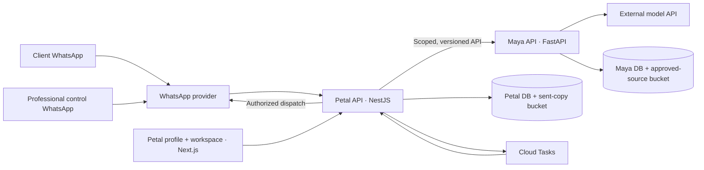

# Engineering Implementation Blueprint: Maya and Petal

**Status:** Engineering director's draft, 30 September 2026. This is an implementation map for discussion, not a claim that code or infrastructure already exists. It complements the [system design document](06-system-design-document.md): that document defines behavior and records; this one explains the proposed codebase, technology choices, deployment units, and development sequence. The [Session 4 architecture](04-technical-architecture-and-engineering-guidelines.md) remains the authority for confirmed technical decisions. Choices labeled **proposed** below require engineering review.

## The picture in one minute

The user's 1 October extension brings a bounded self-improving loop into the MVP. [Document 07](07-self-improving-loop-design-and-mvp-scope.md) now specifies automatic discovery, drafting and isolated evaluation with explicit owner approval/publication, observation and restore. Its mechanisms and settings are proposed, reconciled against the current SDD in the [integration review](reviews/2026-10-01-self-improving-loop-review.md).

We are building a reusable persona engine, **Maya**, and its first market-facing application, **Petal**. Maya knows how to operate a professional's approved persona across separate client relationships. Petal knows who the professional and client are, presents profiles and the workspace, connects WhatsApp, manages cases, and sends messages. A model provider generates or classifies content; neither the model nor Maya may independently decide the WhatsApp recipient or bypass an approval.

The recommended delivery shape is **one repository, two independently deployable backends, and one web application**. One repository keeps contracts and changes reviewable together. Separate deployments and databases preserve the Maya–Petal product boundary, so another application can use Maya later without inheriting Petal's WhatsApp or professional-profile assumptions.



The diagram is logical. An incoming webhook is persisted before work is queued. A Cloud Task invokes a protected handler; it is not a second source of truth or a guaranteed ordering mechanism. Maya returns a **proposal**. Petal checks ownership, permissions, recipient, approvals, and channel rules before sending. [Cloud Tasks can execute out of order and sometimes more than once](https://docs.cloud.google.com/tasks/docs/common-pitfalls), so Petal must enforce per-conversation serialization and idempotency in PostgreSQL.

## What will actually run

| Deployment unit | Responsibility | Starting technology | Status |
|---|---|---|---|
| Maya API | Persona versions, approved knowledge, relationship memory, scoped retrieval, text-turn evaluation, action proposals, Maya audit | Python, [FastAPI](https://fastapi.tiangolo.com/tutorial/first-steps/), Cloud Run | Stack confirmed; internal modules proposed |
| Petal API | Profiles, workspace API, WhatsApp adapter, conversation/case state, professional control chat, authorization, outbound dispatcher, delivery reconciliation | TypeScript, [NestJS](https://docs.nestjs.com/first-steps), Cloud Run | Stack confirmed; internal modules proposed |
| Petal web | Shareable professional profiles and authenticated workspace/inbox | TypeScript, [Next.js](https://nextjs.org/docs/app) and React, Cloud Run | Stack confirmed; hosting details to validate |
| Protected task handlers | Process accepted events, retries, reminders, and delivery follow-up | Cloud Tasks calling authenticated HTTP handlers, initially within the owning API deployment | Cloud Tasks confirmed; handler packaging proposed |
| External services | WhatsApp transport, text model, sign-in, persistent storage | Direct Meta Cloud API target; one external model API; Identity Platform starting choice; GCP data services | Meta route, model, and Identity Platform fit require validation |

Do not create a separate microservice for every box in a diagram. The Petal adapter, coordinator, cases, and dispatcher should begin as modules in the Petal API. Maya configuration, retrieval, runtime, and evaluation should begin as modules in Maya. Split a module into another deployment only if measured load, security isolation, or team ownership justifies it. [Cloud Run services](https://docs.cloud.google.com/run/docs/overview/what-is-cloud-run) support request-driven APIs and protected task endpoints; a continuously running worker pool is unnecessary for this initial Cloud Tasks design.

## Proposed codebase structure

This is the **target layout once implementation is authorized**, not a directory structure already present in this documentation workspace. A monorepo is my recommendation; Maya and Petal still have separate builds, credentials, databases, and releases.

```text
petal-platform/
├── apps/
│   ├── maya-api/                  # Python/FastAPI; deployable on its own
│   │   ├── src/maya/
│   │   │   ├── api/               # Versioned endpoints and request validation
│   │   │   ├── personas/          # Draft, test, approve, publish, restore
│   │   │   ├── knowledge/         # Approved facts and source documents
│   │   │   ├── relationships/     # Private client memory and correction
│   │   │   ├── runtime/           # Context assembly and typed turn decisions
│   │   │   ├── model_adapter/     # Replaceable external model provider
│   │   │   ├── actions/           # Proposal types and Maya-side permission checks
│   │   │   ├── improvement/       # Scoped signals, candidates, isolated eval, review and observation
│   │   │   └── audit/             # Decision, source, version, authority trail
│   │   ├── migrations/           # Maya database only
│   │   └── tests/
│   ├── petal-api/                 # TypeScript/NestJS; deployable on its own
│   │   ├── src/modules/
│   │   │   ├── professionals/     # Workspace owner and public profile data
│   │   │   ├── onboarding/        # Guided setup and go-live gate
│   │   │   ├── whatsapp/          # Provider adapter, webhook, channel bindings
│   │   │   ├── conversations/     # Inbound events, ordering, ownership version
│   │   │   ├── cases/             # Escalation, inbox states, reminders
│   │   │   ├── control-chat/      # Registered professional and case directions
│   │   │   ├── feedback/          # Verified correction scope and canonical learning feed
│   │   │   ├── maya-client/       # Generated or schema-checked API client
│   │   │   ├── authorizations/    # Action and commitment approval rules
│   │   │   ├── dispatch/          # Outbound intent, send, receipt, reconciliation
│   │   │   └── data-lifecycle/    # Inspection, export, deletion coordination
│   │   ├── migrations/           # Petal database only
│   │   └── test/
│   └── petal-web/                 # Next.js profile + professional workspace
│       ├── app/                  # Routes and page composition
│       ├── features/             # Profile, setup, inbox, persona controls
│       └── components/           # Reusable accessible UI
├── contracts/
│   ├── maya-api/                  # Reviewed OpenAPI schema and examples
│   └── events/                    # Shared correlation/event definitions, if used
├── evaluation/
│   ├── maya-cases/                # Two-persona functional cases, no real client data
│   ├── privacy-and-authority/     # Negative isolation and permission cases
│   └── load/                      # Representative 100-conversation scenario
├── infrastructure/
│   └── terraform/                 # Environments, IAM, Cloud Run, SQL, buckets, tasks
├── operations/                    # Runbooks, restore exercise, release evidence
└── docs/                          # ADRs, architecture contracts, role handoffs
```

**Contract rule:** `contracts/maya-api` is the reviewed, versioned boundary. FastAPI can publish OpenAPI; the Petal client is generated or checked against that schema in CI. Both [FastAPI](https://fastapi.tiangolo.com/tutorial/first-steps/) and [NestJS](https://docs.nestjs.com/openapi/introduction) support OpenAPI, but a generated schema alone is insufficient: contract tests must exercise authentication, professional/client scope, idempotency, and backward compatibility. No shared ORM models and no cross-service SQL joins.

**Recommended developer tooling, proposed:** pin Python and Node runtimes; use a Python package/lockfile tool and a TypeScript workspace package manager; run `pytest` for Maya, unit/integration tests for NestJS and web, browser journey tests for the workspace, formatters/linters, type checking, dependency scanning, and contract validation in CI. Select the exact package managers, ORMs, and test runners in the first engineering setup decision; they are not implied by the confirmed architecture. Each service owns its migrations and test fixtures.

## One client message, end to end

Imagine a client asks for an approved service package on the professional's own WhatsApp business number.

1. **Ingress:** The provider posts a webhook to Petal. Petal verifies it, identifies the receiving professional number from a server-side channel binding, and writes an `inbound_event` and message to Petal's database. Only then does it acknowledge receipt to the provider. A provider retry with the same event ID maps to the existing record.
2. **Scheduling and ownership:** Petal schedules processing. A protected task handler serializes work for that conversation through database state, reads `maya_active` and its ownership version, and does not infer identity from message text. Different conversations may proceed in parallel.
3. **Maya turn:** Petal calls the versioned Maya API with authenticated professional, client, conversation, and event scope. Maya loads the published persona, approved relevant knowledge, and **that client's** private memory. It calls the selected external model with the minimum needed context and returns a typed proposal such as `reply`, `ask`, `share_approved_item`, or `escalate`, with source and persona-version references.
4. **Authorization:** Petal treats the proposal as untrusted input. It checks the current ownership version, professional/client scope, item approval, recipient binding, any required human approval, and WhatsApp channel eligibility. A changed ownership version blocks a late Maya response.
5. **Dispatch:** Petal stores an authorized `outbound_intent`; its dispatcher rechecks the relevant state immediately before provider submission. Petal records `pending`, `submitted`, `delivered`, or `failed` distinctly. An uncertain provider response is reconciled before retrying to avoid duplicate sends.
6. **Continuity:** Petal keeps the channel transcript and delivery record. Maya records the decision and any source-linked relationship-memory update in its own database. Shared correlation IDs make one case traceable across both services.

The first Maya reply and the first reply after a professional reply carry the agreed brief AI notice. The sender remains the professional's own business number; the notice tells the client when Maya is responding.

### When Maya cannot decide

An unsupported service fact or a request needing the professional becomes an escalation proposal. Petal creates a case, changes conversation ownership to `awaiting_professional`, increments its version, and alerts the professional through the **separate Petal-managed control WhatsApp number**. A reply to that alert is bound to the identified case. The professional can direct a routine permitted reply in natural language or handle the case in the workspace. Maya pauses that conversation until control is explicitly returned.

For a proposed price, appointment, or other commitment, Petal shows the exact action and recipient in the case-linked control conversation and records the professional's explicit approval. A casual instruction does not publish a policy change or approve an unspecified commitment. Changes to standing persona information are drafted, tested, and published through the workspace.

## Data and infrastructure ownership

| Concern | Maya | Petal |
|---|---|---|
| PostgreSQL | Persona versions, approved knowledge metadata, private relationship memory, Maya decisions and audit | Professionals/profiles, channel bindings, transcripts, conversations, cases, approvals, outbound and delivery records |
| Cloud Storage | Authoritative approved source documents and versions | Exact files sent through WhatsApp and their delivery evidence |
| Service identity | May read only Maya data and the permitted external model secret | May read only Petal data and channel secrets; calls Maya through scoped API |
| Client data access | Professional **and** client relationship scope checked before retrieval | Professional, client, case, and recipient binding checked before action/send |

The initial infrastructure is shared across professionals, in one Singapore GCP region candidate, using [Cloud Run](https://docs.cloud.google.com/run/docs/overview/what-is-cloud-run), [Cloud SQL for PostgreSQL](https://docs.cloud.google.com/sql/docs/postgres/introduction), separate [Cloud Storage](https://docs.cloud.google.com/storage/docs/locations) buckets, [Cloud Tasks](https://docs.cloud.google.com/tasks/docs/comp-pub-sub), [Secret Manager](https://docs.cloud.google.com/secret-manager/docs/locations), and Cloud Logging/Monitoring/tracing. Maya and Petal have separate databases, credentials, buckets, and IAM identities even if Cloud SQL begins as one instance. Cloud Build and Terraform are the starting build/deployment tools. Backups and a tested restore are required before pilot traffic. The exact regional processing of WhatsApp and the model provider must be reviewed separately from the GCP storage region.

We start retrieval with professional-scoped PostgreSQL metadata and text search. Add `pgvector` only if evaluation shows that semantic retrieval improves supported answers without breaking scope isolation. The external text model provider remains unselected; one primary provider is enough for the pilot if it meets quality, latency, cost, and data-handling requirements. The direct Meta Cloud API path is the target but needs a proof of professional-number onboarding, control-number routing, webhooks, sends, and receipts; a partner adapter is the fallback. Identity Platform with TOTP for sensitive workspace changes is a starting choice subject to cost and data-location checks.

## Where Pi, Laya, and RRSI fit

These come from the [One Self, Many Faces reference](https://claude.ai/artifact/3kvkcjiCU6W2ubLdKMqj5L) and our [discussion notes](../conversation-notes.md). They clarify architectural roles but are **not required products in the confirmed MVP stack**.

| Concept | Potential placement | Engineering recommendation |
|---|---|---|
| [Pi](https://pi.dev/) | Inside Maya's `runtime/` as an agent harness for context, tools, and turn control | Keep the Maya runtime interface independent of Pi. The confirmed Maya service is Python/FastAPI; adopt Pi only if an integration spike shows clear benefit over a small purpose-built runtime. |
| [Laya](https://github.com/NandhaKishorM/laya) or a similar classifier | Optional early typed signal for triage, routing, or uncertainty | Evaluate later on Maya's labeled cases. It may suggest escalation but must never be the authority for data access, recipient choice, or commitments. |
| [RRSI](https://regularized-rsi.com/) | Research inspiration for bounded edits, leakage checks, evaluation and cost-aware selection | The bounded workflow is now MVP scope under Document 07: automatic discovery/drafting/testing and explicit owner publication. Installing RRSI or evolving production code is not required. Core belief changes remain deferred. |

The first Maya implementation needs explicit context assembly, typed proposals, permission checks, audit, and evaluation. It does **not** require all three reference projects to be installed. Their roles should remain visible in the architecture so we can make evidence-based choices later.

Maya's `improvement/` modules reuse persona/knowledge publication and the current context manifest; they do not introduce a second active release pointer. Candidates cover one instruction, knowledge, or allowlisted retrieval category. Retrieval tuning needs engineering and professional approval; SQL scope filters and algorithms stay in code. Protected evaluation uses fictional fixtures and has no production-data, channel or publication credentials. Petal's feedback adapter uses canonical feed/work records, and its Learning workspace forwards verified owner review. Publication and restore use the SDD mutation barrier, with no five-second stale-send token or unattended content rollback. Loop queues/model budgets preserve live-turn priority.

## Environments, releases, and evidence

Use isolated development/test and pilot environments with separate secrets and test numbers. Never populate automated evaluation with real client conversations. A change should move through code review, unit and integration tests, contract tests, migration checks, and a test-environment deployment before pilot release. Terraform changes and data migrations need explicit review. Release Maya and Petal independently, but run an integrated compatibility check before Petal points at a new Maya API version.

Operational dashboards should trace a correlation ID through webhook acceptance, queue age, Maya decision, human approval, outbound attempt, and delivery receipt, while routine logs minimize message content. Monitor model failures, unsupported-answer handoffs, stalled cases, failed/duplicate sends, scope denials, cost per conversation, and backup/restore results. Define alert thresholds and a named incident owner before the closed pilot.

The test program should deliberately attempt failures: cross-professional and cross-client retrieval, prompt-injected client messages or documents, duplicate and out-of-order webhooks, a takeover while Maya is generating, a revoked document before send, ambiguous provider submission, model outage, and a lost or changed professional control number. A successful happy-path demo is not release evidence.

## Build order and ownership

1. **Foundation and feasibility:** Freeze the initial Maya API contract and two-persona evaluation cases. Test current Meta onboarding and control-number mechanics. Compare external model candidates and data terms. Create separate service identities, databases, buckets, and CI skeletons.
2. **Maya first:** Build persona lifecycle, approved knowledge and documents, private relationship memory, text runtime, typed proposals, handoff behavior, audit, the bounded improvement modules, and a small internal test interface. Pass the expanded Maya functional gate, including a complete synthetic improvement/restore cycle for both personas, before Petal application implementation begins.
3. **Petal integration:** Build profile/workspace and guided setup, then channel binding and webhook ingress, conversation/case state, professional control chat, the Maya client, authorization, dispatcher, delivery reconciliation, feedback capture and the Learning review workspace. Connect the workspace to Maya-owned content through Maya's API.
4. **Pilot readiness:** Prove isolation and authorization under realistic load with declared loop activity, test at least 100 distinct simultaneous client conversations for one persona, exercise outage, correction/deletion and restore procedures, and complete professional go-live checks. Start the closed pilot with two real professionals only after evidence passes. During pilot, close a real feedback/publication/observation cycle for each persona; expansion to at most five and limited launch follow separate reviews. Reforecast the original pilot-start target for the added work.

The [roadmap](05-implementation-roadmap-pilot-plan-and-launch-criteria.md) contains the current two-month pilot-start forecast and four agentic workstreams. That date is a target, not a reason to waive a failed gate. The user is the initial integration and release owner and reviews every workstream's output. Each workstream should leave a contract, tests/evaluation evidence, runbook, unresolved-risk list, and a role description suitable for later human recruitment.

## Decisions still needed

| Decision | Why it matters | When to close it |
|---|---|---|
| Exact repository tooling, ORM/migration libraries, and test runners | Keeps cross-language development repeatable without premature framework sprawl | Engineering setup |
| Final Maya OpenAPI operations, error codes, and compatibility policy | Allows independent builds without accidental contract drift | Before the first Petal API client |
| Current Meta onboarding route and control-number recovery | Determines whether direct integration and case-linked owner control are feasible | Early feasibility gate |
| External model provider and processing terms | Affects quality, latency, cost, retention, and client-data handling | Before real client traffic |
| Retention/deletion policy, backup retention, and recovery targets | Needed for data lifecycle and honest restore/deletion behavior | Before pilot |
| Numerical latency/error/cost thresholds and pilot service mix | Turns the capacity and pilot gates into measurable decisions | Before the relevant gate |

This blueprint does not settle revenue model, customer pricing, or financial projections. Those belong to the planned business and financial documents. Engineering should measure cost per conversation, document send, and professional workspace so those later projections rest on observed usage rather than invented unit economics.
